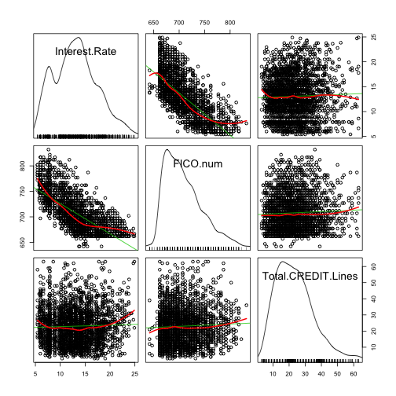

Exploratory data analysis
=========================

Written by L. Collado-Torres.

# Data


```r
## Pkgs used
require(car)
```

```
## Loading required package: car
```

```
## Loading required package: MASS
```

```
## Loading required package: nnet
```

```r

## Load the data
library(lcollado754)
data <- preprocess()
```

```
## Loading required package: plyr
```

```
## Joining by: Amount.Requested, Amount.Funded.By.Investors, Interest.Rate,
## Loan.Length, Loan.Purpose, Debt.To.Income.Ratio, State, Home.Ownership,
## Monthly.Income, FICO.Range, Open.CREDIT.Lines, Revolving.CREDIT.Balance,
## Employment.Length
```

```r

## Basic exploration
head(data)
```

```
##   Amount.Requested Amount.Funded.By.Investors Interest.Rate Loan.Length
## 1            20000                      20000          8.90          36
## 2            19200                      19200         12.12          36
## 3            35000                      35000         21.98          60
## 4            10000                       9975          9.99          36
## 5            12000                      12000         11.71          36
## 6             6000                       6000         15.31          36
##         Loan.Purpose Debt.To.Income.Ratio State Home.Ownership
## 1 debt_consolidation                14.90    SC       MORTGAGE
## 2 debt_consolidation                28.36    TX       MORTGAGE
## 3 debt_consolidation                23.81    CA       MORTGAGE
## 4 debt_consolidation                14.30    KS       MORTGAGE
## 5        credit_card                18.78    NJ           RENT
## 6              other                20.05    CT            OWN
##   Monthly.Income FICO.Range Open.CREDIT.Lines Revolving.CREDIT.Balance
## 1           6542    735-739                14                    14272
## 2           4583    715-719                12                    11140
## 3          11500    690-694                14                    21977
## 4           3833    695-699                10                     9346
## 5           3195    695-699                11                    14469
## 6           4892    670-674                17                    10391
##   Inquiries.in.the.Last.6.Months Employment.Length Issued.Date
## 1                              2          < 1 year  2012-11-02
## 2                              1           2 years  2013-01-17
## 3                              1           2 years  2012-10-23
## 4                              0           5 years  2010-11-03
## 5                              0           9 years  2011-09-30
## 6                              2           3 years  2012-07-25
##   Earliest.CREDIT.Line Total.CREDIT.Lines State.Region State.Coast
## 1           1995-02-25                 43           04        East
## 2           2005-07-24                 20           06        West
## 3           1998-12-31                 33           09        West
## 4           1999-10-29                 16           07        West
## 5           1992-04-07                 14           02        East
## 6           2000-04-15                 34           01        East
##   FICO.num
## 1      737
## 2      717
## 3      692
## 4      697
## 5      697
## 6      672
```

```r
summary(data)
```

```
##  Amount.Requested Amount.Funded.By.Investors Interest.Rate  
##  Min.   : 1000    Min.   :    0              Min.   : 5.42  
##  1st Qu.: 6000    1st Qu.: 6000              1st Qu.:10.16  
##  Median :10000    Median :10000              Median :13.11  
##  Mean   :12406    Mean   :12002              Mean   :13.07  
##  3rd Qu.:17000    3rd Qu.:16000              3rd Qu.:15.80  
##  Max.   :35000    Max.   :35000              Max.   :24.89  
##                                                             
##   Loan.Length               Loan.Purpose  Debt.To.Income.Ratio
##  Min.   :36.0   debt_consolidation:1307   Min.   : 0.00       
##  1st Qu.:36.0   credit_card       : 444   1st Qu.: 9.75       
##  Median :36.0   other             : 201   Median :15.32       
##  Mean   :41.3   home_improvement  : 152   Mean   :15.38       
##  3rd Qu.:36.0   major_purchase    : 101   3rd Qu.:20.67       
##  Max.   :60.0   small_business    :  87   Max.   :34.91       
##                 (Other)           : 208                       
##      State       Home.Ownership Monthly.Income     FICO.Range  
##  CA     : 433   MORTGAGE:1148   Min.   :   588   670-674: 171  
##  NY     : 255   NONE    :   1   1st Qu.:  3500   675-679: 166  
##  TX     : 174   OTHER   :   5   Median :  5000   680-684: 157  
##  FL     : 169   OWN     : 200   Mean   :  5689   695-699: 153  
##  IL     : 101   RENT    :1146   3rd Qu.:  6800   665-669: 145  
##  GA     :  98                   Max.   :102750   690-694: 140  
##  (Other):1270                   NA's   :1        (Other):1568  
##  Open.CREDIT.Lines Revolving.CREDIT.Balance Inquiries.in.the.Last.6.Months
##  Min.   : 2.0      Min.   :     0           Min.   :0.000                 
##  1st Qu.: 7.0      1st Qu.:  5586           1st Qu.:0.000                 
##  Median : 9.0      Median : 10962           Median :0.000                 
##  Mean   :10.1      Mean   : 15245           Mean   :0.906                 
##  3rd Qu.:13.0      3rd Qu.: 18889           3rd Qu.:1.000                 
##  Max.   :38.0      Max.   :270800           Max.   :9.000                 
##  NA's   :2         NA's   :2                NA's   :2                     
##  Employment.Length  Issued.Date         Earliest.CREDIT.Line
##  10+ years:653     Min.   :2007-06-16   Min.   :1969-05-20  
##  < 1 year :250     1st Qu.:2011-03-31   1st Qu.:1994-09-10  
##  2 years  :244     Median :2012-03-09   Median :1998-12-31  
##  3 years  :235     Mean   :2011-10-23   Mean   :1997-11-09  
##  5 years  :202     3rd Qu.:2012-09-17   3rd Qu.:2002-01-26  
##  (Other)  :839     Max.   :2013-01-18   Max.   :2068-09-24  
##  NA's     : 77     NA's   :73           NA's   :2           
##  Total.CREDIT.Lines  State.Region State.Coast    FICO.num  
##  Min.   : 3         09     :523   East:1488   Min.   :642  
##  1st Qu.:15         04     :421   West:1012   1st Qu.:682  
##  Median :22         02     :349               Median :702  
##  Mean   :23         05     :284               Mean   :708  
##  3rd Qu.:30         03     :276               3rd Qu.:727  
##  Max.   :63         06     :243               Max.   :832  
##  NA's   :2          (Other):404
```


# Interest and FICO.Range

The interest rate looks bimodal, or at least it has a peak in the low values.

```r
hist(data$Interest.Rate, col = "light blue", freq = FALSE)
lines(density(data$Interest.Rate), col = "red")
```

 


In the next two plots we see clearly see that the interest rate decreases as your FICO score gets higher. But also, we notice that we have just a handful of cases that were given the worst interest rates, then there is a very steady block, and finally it decreases as the FICO score gets higher.


```r
with(data, boxplot(Interest.Rate ~ FICO.Range, las = 2, ylab = "Interest Rate", 
    main = "Interest Rate by FICO score", col = "orange"))
```

 

```r
barplot(tapply(data$Interest.Rate, data$FICO.Range, length), las = 2, ylab = "Number of observations", 
    main = "Number of observations by FICO score", col = "forest green")
```

 


# Exploration vs State

There doesn't seem to be any overall difference between the coasts. By region there is some variability, specially for region 8. However, this could be explained by the variability in the number of observations by region. In addition, the variability for region 8 is no longer so evident when looking at the FICO score.


```r
with(data, boxplot(Interest.Rate ~ State.Coast, col = "light blue", main = "Interest Rate by Coast"))
```

 

```r
with(data, boxplot(FICO.num ~ State.Coast, col = "orange", main = "FICO (numerical) by Coast"))
```

 

```r

with(data, boxplot(Interest.Rate ~ State.Region, col = "light blue", main = "Interest Rate by Region"))
```

 

```r
with(data, boxplot(FICO.num ~ State.Region, col = "orange", main = "FICO (numerical) by Region"))
```

 

```r

barplot(tapply(data$Interest.Rate, data$State.Region, length), col = "light blue", 
    main = "Observations by Region")
```

 

```r


scatterplotMatrix(~Interest.Rate + FICO.num + State.Region, data = data, spread = FALSE, 
    smooth = FALSE)
```

 


It's fairly clear that there is no point in using the State Coast variable any further. However, the state region might be informative (slightly?) when taking other variables into account.

# Exploration by time

From the top right panel, overall the issued date hasn't affected the mean as much although there is an increasing trend (see the green line). It is also clear that the variability has increased over time.

As for the middle right panel, it seems that lower FICO scores were given back around 2008, but they stabilized around 2009. That's from the smooth line (red one). The overall trend is negative though (slope of green line.)

```r
scatterplotMatrix(~Interest.Rate + FICO.num + Issued.Date, data = data, spread = FALSE)
```

 


Clearly a few entries are wrong! After removing the wrong entries, we can observe that most of the people got their first credit line in the 1990's or after. The peak is around 1998-1999. In addition, the more recent your first credit line is, the lower your FICO score and higher interest (specially for the most recent). 


```r
scatterplotMatrix(~Interest.Rate + FICO.num + Earliest.CREDIT.Line, data = data, 
    spread = FALSE)
```

 

```r
d2 <- subset(data, Earliest.CREDIT.Line <= as.Date("01/01/14", format = "%d/%m/%y"))
scatterplotMatrix(~Interest.Rate + FICO.num + Earliest.CREDIT.Line, data = d2, 
    spread = FALSE)
```

 


# Exploration vs income

The log monthly income has some positive trends with both the FICO and the interest rate. Also, the smooth line reflects what we would expect in the sense that the very rich have the lowest interest rates and highest FICO scores. Still, most of the data is concentrated at the middle area. Also, the log monthly income has a fairly bell-shaped distribution.


```r
scatterplotMatrix(~Interest.Rate + FICO.num + log(Monthly.Income), data = data, 
    spread = FALSE)
```

 


Similarly, the debt to income ratio has a fairly bell-shaped distribution and has relations that reflect what we would expect: higher debt to income ratio leads to lower FICO scores and higher interest rates. Interestingly, the smooth and trend lines are fairly similar.


```r
scatterplotMatrix(~Interest.Rate + FICO.num + Debt.To.Income.Ratio, data = data, 
    spread = FALSE)
```

 


# Amount requested, funded by investors

From the plot below we see that most people request less than 15k and interestingly they get the lower interest rates despite the FICO score being very similar across the whole board. These relationships hold nearly the same for the amount funded by investors, which in retrospect is no surprise because this variable is highly related to the amount requested. It might be worth considering using only one of the two variables in the model as they seem to be highly colinear. That is understandable because the amount funded is bounded by the amount requested. So sadly, no one gets more money than what they asked for! :P


```r
scatterplotMatrix(~Interest.Rate + FICO.num + Amount.Requested + Amount.Funded.By.Investors, 
    data = data, spread = FALSE)
```

 


# Loan purpose and length

We can see below that most loans purpose is either debt consolidation, credit card related, 'other' and home improvement. For the top two, the variability in interest rates pretty much spans the whole range of the data set. Education and renewable energy are the two types that have the lower medians, but then again are very rare in this data set. As for the FICO score, clearly credit cars and debt consolidation are in the bottom range of the spectrum. The difference at the FICO scores is much more notable than when looking at the actual interest rates they got.

In a way, it makes sense to reduce this variable to three options: credit card, debt consolidation, the rest.


```r
barplot(tapply(data$Interest.Rate, data$Loan.Purpose, length), col = "light blue", 
    main = "Observations by Loan Purpose", las = 2, cex.names = 0.6)
```

 

```r
with(data, boxplot(Interest.Rate ~ Loan.Purpose, col = "light blue", main = "Interest Rate by Loan Purpose", 
    las = 2, cex.axis = 0.6))
```

 

```r
with(data, boxplot(FICO.num ~ Loan.Purpose, col = "orange", main = "FICO (numerical) by Loan Purpose", 
    las = 2, cex.axis = 0.6))
```

 


There are only two types of loans in this data. Either for 36 (3 years) or 60 (5 years) months with a 4:1 ratio. Clearly, the interest rate is higher for those requesting a 60 months loan vs a 36 one and that's despite the FICO scores looking fairly similar.


```r
table(data$Loan.Length)
```

```
## 
##   36   60 
## 1952  548
```

```r
with(data, boxplot(Interest.Rate ~ Loan.Length, col = "light blue", main = "Interest Rate by Loan Length (in months)", 
    ylab = "Interest rate"))
```

 

```r
with(data, boxplot(FICO.num ~ Loan.Length, col = "orange", main = "FICO (numerical) by Loan Length (in months)", 
    ylab = "FICO score"))
```

 


# Other credit info

The number of open credit lines is large concentrated around 9 (median) and has some minor relation to the FICO score (negatively) and the interest rate (positively). 


```r
scatterplotMatrix(~Interest.Rate + FICO.num + Open.CREDIT.Lines, data = data, 
    spread = FALSE)
```

 


The total number of credit lines has a similar relationship to the variables of interest as the number of open credit lines. The total number of credit lines has a cone relationship with the number of open credit lines as the number of open lines is bounded by the total number.


```r
scatterplotMatrix(~Interest.Rate + FICO.num + Total.CREDIT.Lines, data = data, 
    spread = FALSE)
```

 

```r
scatterplotMatrix(~Open.CREDIT.Lines + Total.CREDIT.Lines, data = data, spread = FALSE)
```

 


The log revolving credit balance seems to have a more complicated relationship than the other variables with both the FICO score and the interest rate. It is notably better to have a low revolving credit balance as long as it's not 0. Then the distribution is highly compacted in the log scale and then has a _good_ relationship (higher FICO, lower interest) for the end range.


```r
scatterplotMatrix(~Interest.Rate + FICO.num + log(Revolving.CREDIT.Balance + 
    1), data = data, spread = FALSE)
```

 


As for the number of inquiries in the last 6 months, we can see that it has a _bad_ relationship (higher interest, lower FICO) with the variables of interest. But we also have to take into account that the cases with higher number of inquiries are less frequent.


```r
barplot(table(data$Inquiries.in.the.Last.6.Months), col = "forest green", main = "Number of inquiries in the last 6 months")
```

 

```r
with(data, boxplot(Interest.Rate ~ Inquiries.in.the.Last.6.Months, col = "light blue", 
    main = "Interest Rate by # inquiries in past 6 months", ylab = "Interest rate"))
```

 

```r
with(data, boxplot(FICO.num ~ Inquiries.in.the.Last.6.Months, col = "orange", 
    main = "FICO (numerical) by # inquiries in past 6 months", ylab = "FICO score"))
```

 


# Other information: home and employment status

Overall, there doesn't seem to be any relationship between home status and the interest rate or the FICO score. Furthermore, it makes sense to drop some of the groups like _none_ and _other_ because of their low number of observations.


```r
barplot(table(data$Home.Ownership), col = "forest green", main = "Observations by home status")
```

 

```r
with(data, boxplot(Interest.Rate ~ Home.Ownership, col = "light blue", main = "Interest Rate by home status", 
    ylab = "Interest rate"))
```

 

```r
with(data, boxplot(FICO.num ~ Home.Ownership, col = "orange", main = "FICO (numerical) by home status", 
    ylab = "FICO score"))
```

 


Regarding the employment length, well, the data suggests that there is no relationship between this variable and the variables of interest. For instance, the median interest rate is the same for those employed less than a year and those with 10 or more years of employment. The means are also fairly close.


```r
data$Employment.Length.Mod <- factor(data$Employment.Length, levels = c("< 1 year", 
    "1 year", "2 years", "3 years", "4 years", "5 years", "6 years", "7 years", 
    "8 years", "9 years", "10+ years"), ordered = TRUE)
barplot(table(data$Employment.Length.Mod), col = "forest green", main = "Observations by employment length", 
    las = 2)
```

 

```r
with(data, boxplot(Interest.Rate ~ Employment.Length.Mod, col = "light blue", 
    main = "Interest Rate by employment length", ylab = "Interest rate", las = 2))
```

 

```r
with(data, boxplot(FICO.num ~ Employment.Length.Mod, col = "orange", main = "FICO (numerical) by employment length", 
    ylab = "FICO score", las = 2))
```

 

```r
tapply(data$Interest.Rate, data$Employment.Length.Mod, mean)
```

```
##  < 1 year    1 year   2 years   3 years   4 years   5 years   6 years 
##     12.85     12.49     12.85     12.77     13.14     13.40     13.29 
##   7 years   8 years   9 years 10+ years 
##     13.10     13.01     13.15     13.34
```

```r
tapply(data$Interest.Rate, data$Employment.Length.Mod, median)
```

```
##  < 1 year    1 year   2 years   3 years   4 years   5 years   6 years 
##     13.11     12.12     12.65     12.73     13.11     13.11     13.17 
##   7 years   8 years   9 years 10+ years 
##     13.11     13.87     13.11     13.11
```


# postprocess() function

This EDA lead to the creation of the `postprocess()` function that re-arranges some of the variables.


```r
ready <- postprocess(data)
```

```
## Removing the earliest credit line information for 4 observations.
```

```r
head(ready)
```

```
##   Amount.Requested Amount.Funded.By.Investors Interest.Rate Loan.Length
## 1            20000                      20000          8.90          36
## 2            19200                      19200         12.12          36
## 3            35000                      35000         21.98          60
## 4            10000                       9975          9.99          36
## 5            12000                      12000         11.71          36
## 6             6000                       6000         15.31          36
##   Debt.To.Income.Ratio Open.CREDIT.Lines Revolving.CREDIT.Balance
## 1                14.90                14                    14272
## 2                28.36                12                    11140
## 3                23.81                14                    21977
## 4                14.30                10                     9346
## 5                18.78                11                    14469
## 6                20.05                17                    10391
##   Inquiries.in.the.Last.6.Months Issued.Date Earliest.CREDIT.Line
## 1                              2  2012-11-02           1995-02-25
## 2                              1  2013-01-17           2005-07-24
## 3                              1  2012-10-23           1998-12-31
## 4                              0  2010-11-03           1999-10-29
## 5                              0  2011-09-30           1992-04-07
## 6                              2  2012-07-25           2000-04-15
##   Total.CREDIT.Lines State.Region FICO.num Employment.Length.Mod
## 1                 43           04      737              < 1 year
## 2                 20           06      717               2 years
## 3                 33           09      692               2 years
## 4                 16           07      697               5 years
## 5                 14           02      697               9 years
## 6                 34           01      672               3 years
##   Monthly.Income.Log   Loan.Purpose.Mod Home.Ownership.Mod
## 1              8.786 debt_consolidation           MORTGAGE
## 2              8.430 debt_consolidation           MORTGAGE
## 3              9.350 debt_consolidation           MORTGAGE
## 4              8.251 debt_consolidation           MORTGAGE
## 5              8.069        credit_card               RENT
## 6              8.495              other                OWN
```

```r
summary(ready)
```

```
##  Amount.Requested Amount.Funded.By.Investors Interest.Rate  
##  Min.   : 1000    Min.   :    0              Min.   : 5.42  
##  1st Qu.: 6000    1st Qu.: 6000              1st Qu.:10.16  
##  Median :10000    Median :10000              Median :13.11  
##  Mean   :12406    Mean   :12002              Mean   :13.07  
##  3rd Qu.:17000    3rd Qu.:16000              3rd Qu.:15.80  
##  Max.   :35000    Max.   :35000              Max.   :24.89  
##                                                             
##   Loan.Length   Debt.To.Income.Ratio Open.CREDIT.Lines
##  Min.   :36.0   Min.   : 0.00        Min.   : 2.0     
##  1st Qu.:36.0   1st Qu.: 9.75        1st Qu.: 7.0     
##  Median :36.0   Median :15.32        Median : 9.0     
##  Mean   :41.3   Mean   :15.38        Mean   :10.1     
##  3rd Qu.:36.0   3rd Qu.:20.67        3rd Qu.:13.0     
##  Max.   :60.0   Max.   :34.91        Max.   :38.0     
##                                      NA's   :2        
##  Revolving.CREDIT.Balance Inquiries.in.the.Last.6.Months
##  Min.   :     0           Min.   :0.000                 
##  1st Qu.:  5586           1st Qu.:0.000                 
##  Median : 10962           Median :0.000                 
##  Mean   : 15245           Mean   :0.906                 
##  3rd Qu.: 18889           3rd Qu.:1.000                 
##  Max.   :270800           Max.   :9.000                 
##  NA's   :2                NA's   :2                     
##   Issued.Date         Earliest.CREDIT.Line Total.CREDIT.Lines
##  Min.   :2007-06-16   Min.   :1969-05-20   Min.   : 3        
##  1st Qu.:2011-03-31   1st Qu.:1994-09-05   1st Qu.:15        
##  Median :2012-03-09   Median :1998-12-30   Median :22        
##  Mean   :2011-10-23   Mean   :1997-09-30   Mean   :23        
##  3rd Qu.:2012-09-17   3rd Qu.:2002-01-18   3rd Qu.:30        
##  Max.   :2013-01-18   Max.   :2009-03-28   Max.   :63        
##  NA's   :73           NA's   :6            NA's   :2         
##   State.Region    FICO.num   Employment.Length.Mod Monthly.Income.Log
##  09     :523   Min.   :642   10+ years:653         Min.   : 6.38     
##  04     :421   1st Qu.:682   < 1 year :250         1st Qu.: 8.16     
##  02     :349   Median :702   2 years  :244         Median : 8.52     
##  05     :284   Mean   :708   3 years  :235         Mean   : 8.50     
##  03     :276   3rd Qu.:727   5 years  :202         3rd Qu.: 8.82     
##  06     :243   Max.   :832   (Other)  :839         Max.   :11.54     
##  (Other):404                 NA's     : 77         NA's   :1         
##            Loan.Purpose.Mod Home.Ownership.Mod
##  credit_card       : 444    MORTGAGE:1148     
##  debt_consolidation:1307    OWN     : 200     
##  other             : 749    RENT    :1146     
##                             NA's    :   6     
##                                               
##                                               
## 
```


# Reproducibility


```r
sessionInfo()
```

```
## R version 3.0.0 (2013-04-03)
## Platform: x86_64-apple-darwin10.8.0 (64-bit)
## 
## locale:
## [1] en_US.UTF-8/en_US.UTF-8/en_US.UTF-8/C/en_US.UTF-8/en_US.UTF-8
## 
## attached base packages:
## [1] stats     graphics  grDevices utils     datasets  methods   base     
## 
## other attached packages:
## [1] plyr_1.8        car_2.0-17      nnet_7.3-6      MASS_7.3-26    
## [5] markdown_0.5.4  knitr_1.2       lcollado754_0.1
## 
## loaded via a namespace (and not attached):
## [1] digest_0.6.3   evaluate_0.4.3 formatR_0.7    stringr_0.6.2 
## [5] tools_3.0.0
```

```r
print(proc.time())
```

```
##    user  system elapsed 
##  12.726   0.335  15.315
```


