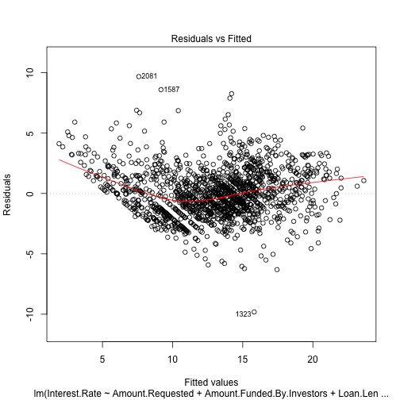
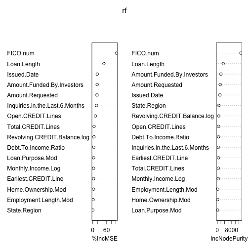

Variable selection
==================

Written by [L. Collado-Torres](http://www.biostat.jhsph.edu/~lcollado/#.UZZK3ivF2L0).

# Setup

Load the data and get it ready to be used in the later steps.


```r
## Pkgs used
require(cvTools)
```

```
## Loading required package: cvTools
```

```
## Loading required package: lattice
```

```
## Loading required package: robustbase
```

```r
require(randomForest)
```

```
## Loading required package: randomForest
```

```
## randomForest 4.6-7
```

```
## Type rfNews() to see new features/changes/bug fixes.
```

```r
require(foreach)
```

```
## Loading required package: foreach
```

```
## foreach: simple, scalable parallel programming from Revolution Analytics
## Use Revolution R for scalability, fault tolerance and more.
## http://www.revolutionanalytics.com
```

```r
require(doSNOW)
```

```
## Loading required package: doSNOW
```

```
## Loading required package: iterators
```

```
## Loading required package: snow
```

```r

## Select the number of cores. By default 4 but can be passed externally
## to this Rmd file.  Basically, defined cores before running knit2html()
if (!"cores" %in% ls()) cores <- 4
registerDoSNOW(makeCluster(cores, type = "SOCK"))
getDoParWorkers()
```

```
## [1] 4
```

```r

## Load and process the data
library(lcollado754)
pre <- preprocess()
```

```
## Joining by: Amount.Requested, Amount.Funded.By.Investors, Interest.Rate,
## Loan.Length, Loan.Purpose, Debt.To.Income.Ratio, State, Home.Ownership,
## Monthly.Income, FICO.Range, Open.CREDIT.Lines, Revolving.CREDIT.Balance,
## Employment.Length
```

```r
fdata <- postprocess(pre)
```

```
## Removing the earliest credit line information for 4 observations.
```

```r

## Drop rows with missing information
dim(fdata)
```

```
## [1] 2500   17
```

```r
fdata <- fdata[complete.cases(fdata), ]
dim(fdata)
```

```
## [1] 2348   17
```

```r

## Quick exploration
summary(fdata)
```

```
##  Amount.Requested Amount.Funded.By.Investors Interest.Rate  
##  Min.   : 1000    Min.   :    0              Min.   : 5.42  
##  1st Qu.: 6000    1st Qu.: 6000              1st Qu.:10.14  
##  Median :10000    Median :10000              Median :13.11  
##  Mean   :12406    Mean   :11979              Mean   :12.99  
##  3rd Qu.:16800    3rd Qu.:16000              3rd Qu.:15.80  
##  Max.   :35000    Max.   :35000              Max.   :24.89  
##                                                             
##   Loan.Length   Debt.To.Income.Ratio Open.CREDIT.Lines
##  Min.   :36.0   Min.   : 0.00        Min.   : 2.0     
##  1st Qu.:36.0   1st Qu.: 9.71        1st Qu.: 7.0     
##  Median :36.0   Median :15.20        Median : 9.0     
##  Mean   :41.3   Mean   :15.25        Mean   :10.1     
##  3rd Qu.:36.0   3rd Qu.:20.50        3rd Qu.:13.0     
##  Max.   :60.0   Max.   :34.91        Max.   :38.0     
##                                                       
##  Revolving.CREDIT.Balance Inquiries.in.the.Last.6.Months
##  Min.   :     0           Min.   :0.000                 
##  1st Qu.:  5526           1st Qu.:0.000                 
##  Median : 10946           Median :0.000                 
##  Mean   : 15212           Mean   :0.906                 
##  3rd Qu.: 18900           3rd Qu.:1.000                 
##  Max.   :270800           Max.   :9.000                 
##                                                         
##   Issued.Date         Earliest.CREDIT.Line Total.CREDIT.Lines
##  Min.   :2007-07-05   Min.   :1969-05-20   Min.   : 3.0      
##  1st Qu.:2011-03-31   1st Qu.:1994-09-02   1st Qu.:15.0      
##  Median :2012-03-07   Median :1998-12-26   Median :22.0      
##  Mean   :2011-10-22   Mean   :1997-10-19   Mean   :23.1      
##  3rd Qu.:2012-09-17   3rd Qu.:2002-01-14   3rd Qu.:30.0      
##  Max.   :2013-01-18   Max.   :2009-03-28   Max.   :63.0      
##                                                              
##   State.Region    FICO.num   Monthly.Income.Log           Loan.Purpose.Mod
##  09     :493   Min.   :642   Min.   : 6.38      credit_card       : 410   
##  04     :397   1st Qu.:682   1st Qu.: 8.16      debt_consolidation:1229   
##  02     :328   Median :702   Median : 8.52      other             : 709   
##  05     :265   Mean   :708   Mean   : 8.51                                
##  03     :262   3rd Qu.:732   3rd Qu.: 8.84                                
##  06     :233   Max.   :832   Max.   :11.54                                
##  (Other):370                                                              
##  Home.Ownership.Mod Employment.Length.Mod
##  MORTGAGE:1078      10+ years:628        
##  OWN     : 183      < 1 year :242        
##  RENT    :1087      2 years  :240        
##                     3 years  :230        
##                     5 years  :193        
##                     4 years  :187        
##                     (Other)  :628
```

```r

## Separate into training and evaluation data sets
set.seed(20130517)
set.idx <- sample(c(TRUE, FALSE), nrow(fdata), replace = TRUE, prob = c(0.7, 
    0.3))

## data will be the training data, edata will be the data set for
## evaluating
data <- fdata[set.idx, ]
edata <- fdata[!set.idx, ]

## Check that the proportion of obs reserved for evaluating the methods is
## around 30%
nrow(edata)/(nrow(edata) + nrow(data))
```

```
## [1] 0.3071
```


# Linear model

Below I fit a linear model, which technically is not correct because the interest rate has a domain of $[0, 100]$. But in the EDA steps it looked fairly bell-shaped and thus the linear model might be good enough. In addition, other variables had bell-shaped distributions.

When exploring the single term deletions, the FICO score is by far the one that affects the model the most.

As we can see, the variable selection does reduce the number of variables and keeps the following ones:
* Amount requested
* Amount funded by investors
* Loan length
* Debt to income ratio
* The number of open credit lines
* Number of inquiries in the last 6 months
* Issued date
* Earliest credit line
* FICO (a must!)
* The log of the monthly income
* The loan purpose
* Home ownership status

Furthermore, we have evidence that the variable selected model performs better than the minimal model of just using the FICO score to determine the interest rate. However the full model is not significantly different from the variable selected model.

Finally, the diagnostic plots for the variable selected model look decent enough. Although there are a few observations that have much higher leverage. In more detail, some of these cases have very high revolving credit balance. It is hard to tell whether other factors are outliers as from a quick exploration most of the values seem to be within the first and third quartiles.


```r
flm <- lm(Interest.Rate ~ ., data = data)
summary(flm)
```

```
## 
## Call:
## lm(formula = Interest.Rate ~ ., data = data)
## 
## Residuals:
##    Min     1Q Median     3Q    Max 
## -9.258 -1.286 -0.142  1.147  9.498 
## 
## Coefficients:
##                                     Estimate Std. Error t value Pr(>|t|)
## (Intercept)                         6.78e+01   2.86e+00   23.68  < 2e-16
## Amount.Requested                    4.23e-05   2.94e-05    1.44   0.1495
## Amount.Funded.By.Investors          1.29e-04   3.02e-05    4.25  2.3e-05
## Loan.Length                         1.32e-01   5.49e-03   24.06  < 2e-16
## Debt.To.Income.Ratio               -1.75e-02   8.09e-03   -2.16   0.0311
## Open.CREDIT.Lines                  -1.54e-02   1.56e-02   -0.99   0.3230
## Revolving.CREDIT.Balance            2.20e-06   3.13e-06    0.70   0.4823
## Inquiries.in.the.Last.6.Months      3.62e-01   4.22e-02    8.57  < 2e-16
## Issued.Date                         2.69e-04   1.51e-04    1.78   0.0755
## Earliest.CREDIT.Line               -4.60e-05   2.40e-05   -1.92   0.0554
## Total.CREDIT.Lines                 -6.01e-04   6.81e-03   -0.09   0.9297
## State.Region02                     -1.28e-01   2.36e-01   -0.54   0.5872
## State.Region03                     -7.29e-02   2.49e-01   -0.29   0.7698
## State.Region04                      7.18e-02   2.32e-01    0.31   0.7567
## State.Region05                     -1.22e-01   2.49e-01   -0.49   0.6250
## State.Region06                      3.76e-01   2.54e-01    1.48   0.1386
## State.Region07                      3.17e-01   3.94e-01    0.80   0.4214
## State.Region08                     -1.24e-01   3.39e-01   -0.37   0.7148
## State.Region09                     -5.69e-03   2.25e-01   -0.03   0.9799
## State.Region10                      2.75e-01   3.22e-01    0.85   0.3927
## FICO.num                           -8.80e-02   1.54e-03  -57.23  < 2e-16
## Monthly.Income.Log                 -4.86e-01   1.30e-01   -3.73   0.0002
## Loan.Purpose.Moddebt_consolidation  2.46e-01   1.39e-01    1.77   0.0767
## Loan.Purpose.Modother               7.14e-01   1.57e-01    4.56  5.6e-06
## Home.Ownership.ModOWN               5.82e-01   1.93e-01    3.02   0.0026
## Home.Ownership.ModRENT              3.30e-01   1.18e-01    2.80   0.0051
## Employment.Length.Mod.L             1.78e-01   1.95e-01    0.92   0.3601
## Employment.Length.Mod.Q            -1.80e-01   1.64e-01   -1.10   0.2720
## Employment.Length.Mod.C            -1.17e-02   1.70e-01   -0.07   0.9452
## Employment.Length.Mod^4             1.54e-01   1.92e-01    0.80   0.4244
## Employment.Length.Mod^5            -1.14e-01   2.09e-01   -0.55   0.5854
## Employment.Length.Mod^6            -4.23e-02   2.11e-01   -0.20   0.8410
## Employment.Length.Mod^7             7.54e-02   2.01e-01    0.37   0.7081
## Employment.Length.Mod^8             1.08e-01   1.94e-01    0.56   0.5767
## Employment.Length.Mod^9            -2.44e-01   1.87e-01   -1.31   0.1916
## Employment.Length.Mod^10           -2.98e-02   1.78e-01   -0.17   0.8667
##                                       
## (Intercept)                        ***
## Amount.Requested                      
## Amount.Funded.By.Investors         ***
## Loan.Length                        ***
## Debt.To.Income.Ratio               *  
## Open.CREDIT.Lines                     
## Revolving.CREDIT.Balance              
## Inquiries.in.the.Last.6.Months     ***
## Issued.Date                        .  
## Earliest.CREDIT.Line               .  
## Total.CREDIT.Lines                    
## State.Region02                        
## State.Region03                        
## State.Region04                        
## State.Region05                        
## State.Region06                        
## State.Region07                        
## State.Region08                        
## State.Region09                        
## State.Region10                        
## FICO.num                           ***
## Monthly.Income.Log                 ***
## Loan.Purpose.Moddebt_consolidation .  
## Loan.Purpose.Modother              ***
## Home.Ownership.ModOWN              ** 
## Home.Ownership.ModRENT             ** 
## Employment.Length.Mod.L               
## Employment.Length.Mod.Q               
## Employment.Length.Mod.C               
## Employment.Length.Mod^4               
## Employment.Length.Mod^5               
## Employment.Length.Mod^6               
## Employment.Length.Mod^7               
## Employment.Length.Mod^8               
## Employment.Length.Mod^9               
## Employment.Length.Mod^10              
## ---
## Signif. codes:  0 '***' 0.001 '**' 0.01 '*' 0.05 '.' 0.1 ' ' 1
## 
## Residual standard error: 1.99 on 1591 degrees of freedom
## Multiple R-squared:  0.774,	Adjusted R-squared:  0.769 
## F-statistic:  156 on 35 and 1591 DF,  p-value: <2e-16
```

```r

## Simple drop results
drop1(flm)
```

```
## Single term deletions
## 
## Model:
## Interest.Rate ~ Amount.Requested + Amount.Funded.By.Investors + 
##     Loan.Length + Debt.To.Income.Ratio + Open.CREDIT.Lines + 
##     Revolving.CREDIT.Balance + Inquiries.in.the.Last.6.Months + 
##     Issued.Date + Earliest.CREDIT.Line + Total.CREDIT.Lines + 
##     State.Region + FICO.num + Monthly.Income.Log + Loan.Purpose.Mod + 
##     Home.Ownership.Mod + Employment.Length.Mod
##                                Df Sum of Sq   RSS  AIC
## <none>                                       6274 2268
## Amount.Requested                1         8  6282 2268
## Amount.Funded.By.Investors      1        71  6345 2284
## Loan.Length                     1      2282  8556 2771
## Debt.To.Income.Ratio            1        18  6292 2271
## Open.CREDIT.Lines               1         4  6277 2267
## Revolving.CREDIT.Balance        1         2  6276 2266
## Inquiries.in.the.Last.6.Months  1       290  6563 2339
## Issued.Date                     1        12  6286 2269
## Earliest.CREDIT.Line            1        14  6288 2270
## Total.CREDIT.Lines              1         0  6274 2266
## State.Region                    9        39  6312 2260
## FICO.num                        1     12916 19189 4085
## Monthly.Income.Log              1        55  6328 2280
## Loan.Purpose.Mod                2        93  6367 2288
## Home.Ownership.Mod              2        51  6324 2277
## Employment.Length.Mod          10        23  6296 2254
```

```r

## Quick step-wise variable selection
flm.aic <- step(flm, trace = 0)
summary(flm.aic)
```

```
## 
## Call:
## lm(formula = Interest.Rate ~ Amount.Requested + Amount.Funded.By.Investors + 
##     Loan.Length + Debt.To.Income.Ratio + Inquiries.in.the.Last.6.Months + 
##     Issued.Date + Earliest.CREDIT.Line + FICO.num + Monthly.Income.Log + 
##     Loan.Purpose.Mod + Home.Ownership.Mod, data = data)
## 
## Residuals:
##    Min     1Q Median     3Q    Max 
## -9.332 -1.326 -0.135  1.147  9.705 
## 
## Coefficients:
##                                     Estimate Std. Error t value Pr(>|t|)
## (Intercept)                         6.81e+01   2.80e+00   24.29  < 2e-16
## Amount.Requested                    4.24e-05   2.91e-05    1.46   0.1458
## Amount.Funded.By.Investors          1.30e-04   3.00e-05    4.32  1.6e-05
## Loan.Length                         1.32e-01   5.43e-03   24.34  < 2e-16
## Debt.To.Income.Ratio               -1.93e-02   7.15e-03   -2.70   0.0069
## Inquiries.in.the.Last.6.Months      3.52e-01   4.13e-02    8.53  < 2e-16
## Issued.Date                         2.76e-04   1.47e-04    1.88   0.0605
## Earliest.CREDIT.Line               -4.76e-05   2.23e-05   -2.14   0.0328
## FICO.num                           -8.82e-02   1.52e-03  -57.99  < 2e-16
## Monthly.Income.Log                 -5.14e-01   1.16e-01   -4.41  1.1e-05
## Loan.Purpose.Moddebt_consolidation  2.40e-01   1.37e-01    1.75   0.0804
## Loan.Purpose.Modother               6.99e-01   1.54e-01    4.54  6.1e-06
## Home.Ownership.ModOWN               5.40e-01   1.89e-01    2.85   0.0044
## Home.Ownership.ModRENT              2.76e-01   1.10e-01    2.51   0.0122
##                                       
## (Intercept)                        ***
## Amount.Requested                      
## Amount.Funded.By.Investors         ***
## Loan.Length                        ***
## Debt.To.Income.Ratio               ** 
## Inquiries.in.the.Last.6.Months     ***
## Issued.Date                        .  
## Earliest.CREDIT.Line               *  
## FICO.num                           ***
## Monthly.Income.Log                 ***
## Loan.Purpose.Moddebt_consolidation .  
## Loan.Purpose.Modother              ***
## Home.Ownership.ModOWN              ** 
## Home.Ownership.ModRENT             *  
## ---
## Signif. codes:  0 '***' 0.001 '**' 0.01 '*' 0.05 '.' 0.1 ' ' 1
## 
## Residual standard error: 1.98 on 1613 degrees of freedom
## Multiple R-squared:  0.772,	Adjusted R-squared:  0.77 
## F-statistic:  420 on 13 and 1613 DF,  p-value: <2e-16
```

```r

## Minimal model
small <- lm(Interest.Rate ~ FICO.num, data = data)
summary(small)
```

```
## 
## Call:
## lm(formula = Interest.Rate ~ FICO.num, data = data)
## 
## Residuals:
##    Min     1Q Median     3Q    Max 
## -8.001 -2.108 -0.476  1.767  9.035 
## 
## Coefficients:
##             Estimate Std. Error t value Pr(>|t|)    
## (Intercept) 71.96701    1.46603    49.1   <2e-16 ***
## FICO.num    -0.08316    0.00207   -40.2   <2e-16 ***
## ---
## Signif. codes:  0 '***' 0.001 '**' 0.01 '*' 0.05 '.' 0.1 ' ' 1
## 
## Residual standard error: 2.93 on 1625 degrees of freedom
## Multiple R-squared:  0.499,	Adjusted R-squared:  0.499 
## F-statistic: 1.62e+03 on 1 and 1625 DF,  p-value: <2e-16
```

```r

## Is the model an improvement over just using the FICO score?
anova(small, flm.aic, flm)
```

```
## Analysis of Variance Table
## 
## Model 1: Interest.Rate ~ FICO.num
## Model 2: Interest.Rate ~ Amount.Requested + Amount.Funded.By.Investors + 
##     Loan.Length + Debt.To.Income.Ratio + Inquiries.in.the.Last.6.Months + 
##     Issued.Date + Earliest.CREDIT.Line + FICO.num + Monthly.Income.Log + 
##     Loan.Purpose.Mod + Home.Ownership.Mod
## Model 3: Interest.Rate ~ Amount.Requested + Amount.Funded.By.Investors + 
##     Loan.Length + Debt.To.Income.Ratio + Open.CREDIT.Lines + 
##     Revolving.CREDIT.Balance + Inquiries.in.the.Last.6.Months + 
##     Issued.Date + Earliest.CREDIT.Line + Total.CREDIT.Lines + 
##     State.Region + FICO.num + Monthly.Income.Log + Loan.Purpose.Mod + 
##     Home.Ownership.Mod + Employment.Length.Mod
##   Res.Df   RSS Df Sum of Sq      F Pr(>F)    
## 1   1625 13921                               
## 2   1613  6340 12      7581 160.22 <2e-16 ***
## 3   1591  6274 22        66   0.77   0.77    
## ---
## Signif. codes:  0 '***' 0.001 '**' 0.01 '*' 0.05 '.' 0.1 ' ' 1
```

```r

## Diagnostic plots
plot(flm.aic)
```

    

```r

## A deeper look at the observations with high leverage
data[hatvalues(flm.aic) > 0.03, ]
```

```
##      Amount.Requested Amount.Funded.By.Investors Interest.Rate Loan.Length
## 76               6725                      825.0         13.12          36
## 133             24625                      917.3         14.07          36
## 236             20000                     2050.0         12.84          36
## 523             14700                     1973.8         12.29          36
## 701             21000                     6165.3         11.09          36
## 834             24000                     7100.0         11.12          60
## 1242            35000                    14869.5         15.65          60
## 1413            20000                     6350.0         16.71          36
## 1464            25000                    11696.9         12.84          36
## 1669            24000                     9675.0         17.15          36
## 1769            22350                      486.1         14.07          36
## 1965            30000                    17982.9         17.88          60
## 2323             2500                     2125.0         12.92          36
## 2383             8500                     6727.4         16.83          36
##      Debt.To.Income.Ratio Open.CREDIT.Lines Revolving.CREDIT.Balance
## 76                  13.16                10                     5513
## 133                 12.81                14                    33698
## 236                  1.49                 6                     1954
## 523                 21.94                14                    14694
## 701                 21.28                31                   270800
## 834                 11.99                 6                     1726
## 1242                26.19                14                    34883
## 1413                20.83                11                    11881
## 1464                 5.52                 9                     1900
## 1669                12.70                14                    40099
## 1769                 3.66                 8                    10753
## 1965                24.36                10                    24217
## 2323                22.32                21                     4744
## 2383                14.68                 9                        0
##      Inquiries.in.the.Last.6.Months Issued.Date Earliest.CREDIT.Line
## 76                                9  2007-07-08           1991-05-13
## 133                               0  2007-12-21           1993-04-24
## 236                               5  2009-04-28           1998-08-10
## 523                               2  2008-03-05           2002-10-19
## 701                               5  2008-01-10           1984-02-01
## 834                               2  2010-07-15           2001-02-17
## 1242                              0  2011-04-29           1990-04-05
## 1413                              4  2008-03-13           1999-03-20
## 1464                              4  2009-02-12           1985-06-14
## 1669                              6  2008-11-10           2000-02-09
## 1769                              2  2007-12-26           1992-02-04
## 1965                              0  2011-04-29           2003-05-11
## 2323                              9  2008-03-28           1990-09-22
## 2383                              9  2008-11-17           1977-04-20
##      Total.CREDIT.Lines State.Region FICO.num Monthly.Income.Log
## 76                   32           07      672              8.517
## 133                  24           02      677              9.210
## 236                  14           05      752              8.161
## 523                  18           01      702              8.039
## 701                  61           09      747              9.816
## 834                  20           08      777              8.646
## 1242                 30           04      737              8.750
## 1413                 16           02      662              8.582
## 1464                 35           05      762              9.067
## 1669                 31           04      672              9.825
## 1769                 15           02      672              9.328
## 1965                 21           02      692              8.636
## 2323                 35           05      672              8.230
## 2383                 17           05      682              8.517
##        Loan.Purpose.Mod Home.Ownership.Mod Employment.Length.Mod
## 76   debt_consolidation           MORTGAGE             10+ years
## 133         credit_card           MORTGAGE               8 years
## 236               other           MORTGAGE               2 years
## 523  debt_consolidation               RENT               8 years
## 701               other                OWN               2 years
## 834               other                OWN               2 years
## 1242              other           MORTGAGE             10+ years
## 1413 debt_consolidation               RENT                1 year
## 1464              other           MORTGAGE             10+ years
## 1669 debt_consolidation               RENT               5 years
## 1769              other                OWN                1 year
## 1965              other               RENT               5 years
## 2323 debt_consolidation           MORTGAGE               7 years
## 2383 debt_consolidation               RENT             10+ years
```


# Cross-validate the linear model


```r
## CV setup
seed <- 201305017
K <- 10
R <- 5
set.seed(seed)
folds <- cvFolds(nrow(data), K = K, R = R)

## Run it
cv.flmaic <- cvFit(flm.aic, y = data$Interest.Rate, data = data, folds = folds, 
    costArgs = list(includeSE = TRUE))

## Estimate of the prediction error using rmspe: robust mean squared
## prediction error
cv.flmaic
```

```
## 10-fold CV results:
##    CV 
## 1.993
```

```r
cv.flmaic$se
```

```
##       CV 
## 0.001444
```


# Random forest


```r
# rf <- foreach(ntree = rep(100, cores), .combine = combine, .packages =
# 'randomForest') %dopar% randomForest(x = data, y = data$Interest.Rate,
# data = data, xtest = edata, ytest = edata$Interest.Rate, importance =
# TRUE, keep.forest = TRUE, ntree = ntree)
rf <- foreach(ntree = rep(200, cores), .combine = combine, .packages = "randomForest") %dopar% 
    randomForest(Interest.Rate ~ ., data = data, importance = TRUE, keep.forest = TRUE, 
        ntree = ntree, xtest = edata[, -which(colnames(edata) == "Interest.Rate")], 
        ytest = edata$Interest.Rate)

## Importance
rf$importance
```

```
##                                  %IncMSE IncNodePurity
## Amount.Requested                1.426341        1613.5
## Amount.Funded.By.Investors      1.780852        1950.3
## Loan.Length                     3.989360        3245.9
## Debt.To.Income.Ratio            0.126713         652.3
## Open.CREDIT.Lines               0.256897         660.9
## Revolving.CREDIT.Balance        0.152837         704.7
## Inquiries.in.the.Last.6.Months  0.479467         611.9
## Issued.Date                     0.771478        1451.8
## Earliest.CREDIT.Line            0.067815         590.7
## Total.CREDIT.Lines              0.110523         584.6
## State.Region                   -0.006018         822.0
## FICO.num                       17.584790       13292.7
## Monthly.Income.Log              0.095690         516.6
## Loan.Purpose.Mod                0.049812         155.9
## Home.Ownership.Mod              0.057561         172.4
## Employment.Length.Mod           0.017095         239.2
```

```r
rf$importanceSD
```

```
##               Amount.Requested     Amount.Funded.By.Investors 
##                        0.07747                        0.09013 
##                    Loan.Length           Debt.To.Income.Ratio 
##                        0.08241                        0.02615 
##              Open.CREDIT.Lines       Revolving.CREDIT.Balance 
##                        0.02159                        0.03065 
## Inquiries.in.the.Last.6.Months                    Issued.Date 
##                        0.03091                        0.04094 
##           Earliest.CREDIT.Line             Total.CREDIT.Lines 
##                        0.02373                        0.02171 
##                   State.Region                       FICO.num 
##                        0.02491                        0.15995 
##             Monthly.Income.Log               Loan.Purpose.Mod 
##                        0.02387                        0.01432 
##             Home.Ownership.Mod          Employment.Length.Mod 
##                        0.01698                        0.01464
```

```r

## Importance plot
varImpPlot(rf)
```

 

```r

## variables used
rf.used <- data.frame(Var = rownames(rf$importance), Used = varUsed(rf))
rf.used
```

```
##                               Var  Used
## 1                Amount.Requested 29074
## 2      Amount.Funded.By.Investors 32307
## 3                     Loan.Length  5294
## 4            Debt.To.Income.Ratio 31762
## 5               Open.CREDIT.Lines 27337
## 6        Revolving.CREDIT.Balance 32085
## 7  Inquiries.in.the.Last.6.Months 13787
## 8                     Issued.Date 42061
## 9            Earliest.CREDIT.Line 31215
## 10             Total.CREDIT.Lines 29283
## 11                   State.Region 39024
## 12                       FICO.num 40123
## 13             Monthly.Income.Log 30091
## 14               Loan.Purpose.Mod 10867
## 15             Home.Ownership.Mod 10177
## 16          Employment.Length.Mod 19791
```

```r

## Prediction error
e.rf <- rmspe(edata$Interest.Rate, predict(rf, edata), includeSE = TRUE)
e.rf
```

```
## $rmspe
## [1] 1.592
## 
## $se
## [1] 0.05727
```

```r

## Cross validate the rf and see how many variables should be used: result
## is 8
rf.cv <- rfcv(trainx = data[, -which(colnames(data) == "Interest.Rate")], trainy = data$Interest.Rate, 
    keep.forest = TRUE, ntree = 100)
with(rf.cv, plot(n.var, error.cv, log = "x", type = "o", lwd = 2))
```

 

```r

## Select the top 8 variables
varsToUse <- rownames(rf$importance)[order(rf$importance[, 1], decreasing = TRUE)[1:8]]
varsToUse
```

```
## [1] "FICO.num"                       "Loan.Length"                   
## [3] "Amount.Funded.By.Investors"     "Amount.Requested"              
## [5] "Issued.Date"                    "Inquiries.in.the.Last.6.Months"
## [7] "Open.CREDIT.Lines"              "Revolving.CREDIT.Balance"
```

```r

## Looks similar to the ones selected with lm and step
flm.aic$call
```

```
## lm(formula = Interest.Rate ~ Amount.Requested + Amount.Funded.By.Investors + 
##     Loan.Length + Debt.To.Income.Ratio + Inquiries.in.the.Last.6.Months + 
##     Issued.Date + Earliest.CREDIT.Line + FICO.num + Monthly.Income.Log + 
##     Loan.Purpose.Mod + Home.Ownership.Mod, data = data)
```

```r

## Random forest with
paste(varsToUse, collapse = " + ")  # To get the vars
```

```
## [1] "FICO.num + Loan.Length + Amount.Funded.By.Investors + Amount.Requested + Issued.Date + Inquiries.in.the.Last.6.Months + Open.CREDIT.Lines + Revolving.CREDIT.Balance"
```

```r
rf2 <- foreach(ntree = rep(100, cores), .combine = combine, .packages = "randomForest") %dopar% 
    randomForest(Interest.Rate ~ FICO.num + Loan.Length + Amount.Funded.By.Investors + 
        Amount.Requested + Issued.Date + Inquiries.in.the.Last.6.Months + Open.CREDIT.Lines + 
        Revolving.CREDIT.Balance, data = data, importance = TRUE, keep.forest = TRUE, 
        ntree = ntree, xtest = edata[, which(colnames(edata) %in% varsToUse)], 
        ytest = edata$Interest.Rate)

## Importance
rf2$importance
```

```
##                                %IncMSE IncNodePurity
## FICO.num                       17.3698       12981.6
## Loan.Length                     4.0683        3272.2
## Amount.Funded.By.Investors      2.4278        2415.4
## Amount.Requested                2.0565        2120.2
## Issued.Date                     1.0829        2177.2
## Inquiries.in.the.Last.6.Months  0.6584         883.7
## Open.CREDIT.Lines               0.4542        1285.6
## Revolving.CREDIT.Balance        0.2538        1467.9
```

```r
rf2$importanceSD
```

```
##                       FICO.num                    Loan.Length 
##                        0.26519                        0.10893 
##     Amount.Funded.By.Investors               Amount.Requested 
##                        0.18962                        0.13215 
##                    Issued.Date Inquiries.in.the.Last.6.Months 
##                        0.07513                        0.05184 
##              Open.CREDIT.Lines       Revolving.CREDIT.Balance 
##                        0.04533                        0.05806
```

```r

## Importance plot
varImpPlot(rf2)
```

 

```r

## variables used
rf2.used <- data.frame(Var = rownames(rf$importance), Used = varUsed(rf))
rf2.used
```

```
##                               Var  Used
## 1                Amount.Requested 29074
## 2      Amount.Funded.By.Investors 32307
## 3                     Loan.Length  5294
## 4            Debt.To.Income.Ratio 31762
## 5               Open.CREDIT.Lines 27337
## 6        Revolving.CREDIT.Balance 32085
## 7  Inquiries.in.the.Last.6.Months 13787
## 8                     Issued.Date 42061
## 9            Earliest.CREDIT.Line 31215
## 10             Total.CREDIT.Lines 29283
## 11                   State.Region 39024
## 12                       FICO.num 40123
## 13             Monthly.Income.Log 30091
## 14               Loan.Purpose.Mod 10867
## 15             Home.Ownership.Mod 10177
## 16          Employment.Length.Mod 19791
```

```r

## Prediction error
e.rf2 <- rmspe(edata$Interest.Rate, predict(rf2, edata), includeSE = TRUE)
e.rf2
```

```
## $rmspe
## [1] 1.547
## 
## $se
## [1] 0.05663
```

```r
## Slightly better than before
```


# Evaluate the methods

The last random forest model performs better than the linear model and the naive random forest. This model will be used in the successive steps.


```r
## Methods evaluated on the 30% of the data using robust mean squared
## prediction error (rmspe)
cv.flmaic
```

```
## 10-fold CV results:
##    CV 
## 1.993
```

```r
cv.flmaic$se
```

```
##       CV 
## 0.001444
```

```r
e.rf
```

```
## $rmspe
## [1] 1.592
## 
## $se
## [1] 0.05727
```

```r
e.rf2
```

```
## $rmspe
## [1] 1.547
## 
## $se
## [1] 0.05663
```


# Save the model to be used


```r

model <- rf2
save(model, file = "model.Rdata")
```


# Reproducibility


```r
sessionInfo()
```

```
## R version 3.0.0 (2013-04-03)
## Platform: x86_64-apple-darwin10.8.0 (64-bit)
## 
## locale:
## [1] en_US.UTF-8/en_US.UTF-8/en_US.UTF-8/C/en_US.UTF-8/en_US.UTF-8
## 
## attached base packages:
## [1] stats     graphics  grDevices utils     datasets  methods   base     
## 
## other attached packages:
##  [1] doSNOW_1.0.6       snow_0.3-12        iterators_1.0.6   
##  [4] foreach_1.4.0      randomForest_4.6-7 cvTools_0.3.2     
##  [7] robustbase_0.9-7   lattice_0.20-15    plyr_1.8          
## [10] car_2.0-17         nnet_7.3-6         MASS_7.3-26       
## [13] markdown_0.5.4     knitr_1.2          lcollado754_0.1   
## 
## loaded via a namespace (and not attached):
## [1] codetools_0.2-8 compiler_3.0.0  digest_0.6.3    evaluate_0.4.3 
## [5] formatR_0.7     grid_3.0.0      stringr_0.6.2   tools_3.0.0
```

```r
print(proc.time())
```

```
##    user  system elapsed 
##  32.172   1.242  42.900
```


