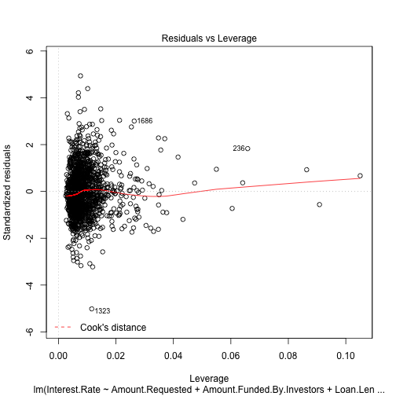
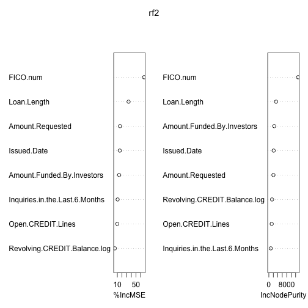

Variable selection
==================

Written by [L. Collado-Torres](http://www.biostat.jhsph.edu/~lcollado/#.UZZK3ivF2L0).

# Setup

Load the data and get it ready to be used in the later steps.


```r
## Pkgs used
require(cvTools)
```

```
## Loading required package: cvTools
```

```
## Loading required package: lattice
```

```
## Loading required package: robustbase
```

```r
require(randomForest)
```

```
## Loading required package: randomForest
```

```
## randomForest 4.6-7
```

```
## Type rfNews() to see new features/changes/bug fixes.
```

```r
require(foreach)
```

```
## Loading required package: foreach
```

```
## foreach: simple, scalable parallel programming from Revolution Analytics
## Use Revolution R for scalability, fault tolerance and more.
## http://www.revolutionanalytics.com
```

```r
require(doSNOW)
```

```
## Loading required package: doSNOW
```

```
## Loading required package: iterators
```

```
## Loading required package: snow
```

```r

## Select the number of cores. By default 4 but can be passed externally
## to this Rmd file.  Basically, defined cores before running knit2html()
if (!"cores" %in% ls()) cores <- 4
registerDoSNOW(makeCluster(cores, type = "SOCK"))
getDoParWorkers()
```

```
## [1] 4
```

```r

## Load and process the data
library(lcollado754)
pre <- preprocess()
```

```
## Joining by: Amount.Requested, Amount.Funded.By.Investors, Interest.Rate,
## Loan.Length, Loan.Purpose, Debt.To.Income.Ratio, State, Home.Ownership,
## Monthly.Income, FICO.Range, Open.CREDIT.Lines, Revolving.CREDIT.Balance,
## Employment.Length
```

```r
fdata <- postprocess(pre)
```

```
## Removing the earliest credit line information for 4 observations.
```

```r

## Drop rows with missing information
dim(fdata)
```

```
## [1] 2500   17
```

```r
fdata <- fdata[complete.cases(fdata), ]
dim(fdata)
```

```
## [1] 2348   17
```

```r

## Quick exploration
summary(fdata)
```

```
##  Amount.Requested Amount.Funded.By.Investors Interest.Rate  
##  Min.   : 1000    Min.   :    0              Min.   : 5.42  
##  1st Qu.: 6000    1st Qu.: 6000              1st Qu.:10.14  
##  Median :10000    Median :10000              Median :13.11  
##  Mean   :12406    Mean   :11979              Mean   :12.99  
##  3rd Qu.:16800    3rd Qu.:16000              3rd Qu.:15.80  
##  Max.   :35000    Max.   :35000              Max.   :24.89  
##                                                             
##   Loan.Length   Debt.To.Income.Ratio Open.CREDIT.Lines
##  Min.   :36.0   Min.   : 0.00        Min.   : 2.0     
##  1st Qu.:36.0   1st Qu.: 9.71        1st Qu.: 7.0     
##  Median :36.0   Median :15.20        Median : 9.0     
##  Mean   :41.3   Mean   :15.25        Mean   :10.1     
##  3rd Qu.:36.0   3rd Qu.:20.50        3rd Qu.:13.0     
##  Max.   :60.0   Max.   :34.91        Max.   :38.0     
##                                                       
##  Inquiries.in.the.Last.6.Months  Issued.Date         Earliest.CREDIT.Line
##  Min.   :0.000                  Min.   :2007-07-05   Min.   :1969-05-20  
##  1st Qu.:0.000                  1st Qu.:2011-03-31   1st Qu.:1994-09-02  
##  Median :0.000                  Median :2012-03-07   Median :1998-12-26  
##  Mean   :0.906                  Mean   :2011-10-22   Mean   :1997-10-19  
##  3rd Qu.:1.000                  3rd Qu.:2012-09-17   3rd Qu.:2002-01-14  
##  Max.   :9.000                  Max.   :2013-01-18   Max.   :2009-03-28  
##                                                                          
##  Total.CREDIT.Lines  State.Region    FICO.num   Monthly.Income.Log
##  Min.   : 3.0       09     :493   Min.   :642   Min.   : 6.38     
##  1st Qu.:15.0       04     :397   1st Qu.:682   1st Qu.: 8.16     
##  Median :22.0       02     :328   Median :702   Median : 8.52     
##  Mean   :23.1       05     :265   Mean   :708   Mean   : 8.51     
##  3rd Qu.:30.0       03     :262   3rd Qu.:732   3rd Qu.: 8.84     
##  Max.   :63.0       06     :233   Max.   :832   Max.   :11.54     
##                     (Other):370                                   
##            Loan.Purpose.Mod Home.Ownership.Mod Employment.Length.Mod
##  credit_card       : 410    MORTGAGE:1078      10+ years:628        
##  debt_consolidation:1229    OWN     : 183      < 1 year :242        
##  other             : 709    RENT    :1087      2 years  :240        
##                                                3 years  :230        
##                                                5 years  :193        
##                                                4 years  :187        
##                                                (Other)  :628        
##  Revolving.CREDIT.Balance.log
##  Min.   : 0.00               
##  1st Qu.: 8.62               
##  Median : 9.30               
##  Mean   : 9.02               
##  3rd Qu.: 9.85               
##  Max.   :12.51               
## 
```

```r

## Separate into training and evaluation data sets
set.seed(20130517)
set.idx <- sample(c(TRUE, FALSE), nrow(fdata), replace = TRUE, prob = c(0.7, 
    0.3))

## data will be the training data, edata will be the data set for
## evaluating
data <- fdata[set.idx, ]
edata <- fdata[!set.idx, ]

## Check that the proportion of obs reserved for evaluating the methods is
## around 30%
nrow(edata)/(nrow(edata) + nrow(data))
```

```
## [1] 0.3071
```


# Linear model

Below I fit a linear model, which technically is not correct because the interest rate has a domain of $[0, 100]$. But in the EDA steps it looked fairly bell-shaped and thus the linear model might be good enough. In addition, other variables had bell-shaped distributions.

When exploring the single term deletions, the FICO score is by far the one that affects the model the most.

As we can see, the variable selection does reduce the number of variables and keeps the following ones:
* Amount requested
* Amount funded by investors
* Loan length
* Debt to income ratio
* The number of open credit lines
* Number of inquiries in the last 6 months
* Issued date
* Earliest credit line
* FICO (a must!)
* The log of the monthly income
* The loan purpose
* Home ownership status

Furthermore, we have evidence that the variable selected model performs better than the minimal model of just using the FICO score to determine the interest rate. However the full model is not significantly different from the variable selected model.

Finally, the diagnostic plots for the variable selected model look decent enough. Although there are a few observations that have much higher leverage. In more detail, some of these cases have very high revolving credit balance. It is hard to tell whether other factors are outliers as from a quick exploration most of the values seem to be within the first and third quartiles.


```r
flm <- lm(Interest.Rate ~ ., data = data)
summary(flm)
```

```
## 
## Call:
## lm(formula = Interest.Rate ~ ., data = data)
## 
## Residuals:
##    Min     1Q Median     3Q    Max 
## -9.734 -1.284 -0.132  1.168  9.471 
## 
## Coefficients:
##                                     Estimate Std. Error t value Pr(>|t|)
## (Intercept)                         6.95e+01   2.86e+00   24.26  < 2e-16
## Amount.Requested                    5.17e-05   2.92e-05    1.77  0.07707
## Amount.Funded.By.Investors          1.25e-04   3.00e-05    4.17  3.2e-05
## Loan.Length                         1.32e-01   5.45e-03   24.16  < 2e-16
## Debt.To.Income.Ratio               -9.77e-03   7.99e-03   -1.22  0.22111
## Open.CREDIT.Lines                  -4.14e-03   1.56e-02   -0.27  0.79000
## Inquiries.in.the.Last.6.Months      3.43e-01   4.20e-02    8.17  6.0e-16
## Issued.Date                         2.47e-04   1.49e-04    1.65  0.09827
## Earliest.CREDIT.Line               -4.72e-05   2.38e-05   -1.98  0.04732
## Total.CREDIT.Lines                 -9.08e-04   6.76e-03   -0.13  0.89318
## State.Region02                     -1.23e-01   2.35e-01   -0.52  0.60078
## State.Region03                     -1.38e-01   2.47e-01   -0.56  0.57839
## State.Region04                      4.73e-02   2.30e-01    0.21  0.83719
## State.Region05                     -1.82e-01   2.47e-01   -0.74  0.46065
## State.Region06                      3.44e-01   2.52e-01    1.37  0.17200
## State.Region07                      2.83e-01   3.91e-01    0.72  0.46863
## State.Region08                     -1.45e-01   3.36e-01   -0.43  0.66583
## State.Region09                     -2.78e-02   2.24e-01   -0.12  0.90132
## State.Region10                      2.44e-01   3.19e-01    0.76  0.44498
## FICO.num                           -8.91e-02   1.54e-03  -57.79  < 2e-16
## Monthly.Income.Log                 -3.75e-01   1.26e-01   -2.97  0.00301
## Loan.Purpose.Moddebt_consolidation  1.97e-01   1.37e-01    1.44  0.15128
## Loan.Purpose.Modother               5.78e-01   1.57e-01    3.68  0.00024
## Home.Ownership.ModOWN               5.51e-01   1.91e-01    2.88  0.00407
## Home.Ownership.ModRENT              2.61e-01   1.17e-01    2.23  0.02582
## Employment.Length.Mod.L             1.91e-01   1.93e-01    0.99  0.32234
## Employment.Length.Mod.Q            -1.45e-01   1.63e-01   -0.89  0.37334
## Employment.Length.Mod.C            -1.31e-02   1.69e-01   -0.08  0.93815
## Employment.Length.Mod^4             1.74e-01   1.91e-01    0.91  0.36046
## Employment.Length.Mod^5            -1.07e-01   2.07e-01   -0.52  0.60617
## Employment.Length.Mod^6            -3.29e-02   2.09e-01   -0.16  0.87484
## Employment.Length.Mod^7             6.59e-02   2.00e-01    0.33  0.74176
## Employment.Length.Mod^8             9.81e-02   1.93e-01    0.51  0.61083
## Employment.Length.Mod^9            -2.42e-01   1.85e-01   -1.31  0.19162
## Employment.Length.Mod^10           -2.35e-02   1.76e-01   -0.13  0.89374
## Revolving.CREDIT.Balance.log       -1.76e-01   3.63e-02   -4.86  1.3e-06
##                                       
## (Intercept)                        ***
## Amount.Requested                   .  
## Amount.Funded.By.Investors         ***
## Loan.Length                        ***
## Debt.To.Income.Ratio                  
## Open.CREDIT.Lines                     
## Inquiries.in.the.Last.6.Months     ***
## Issued.Date                        .  
## Earliest.CREDIT.Line               *  
## Total.CREDIT.Lines                    
## State.Region02                        
## State.Region03                        
## State.Region04                        
## State.Region05                        
## State.Region06                        
## State.Region07                        
## State.Region08                        
## State.Region09                        
## State.Region10                        
## FICO.num                           ***
## Monthly.Income.Log                 ** 
## Loan.Purpose.Moddebt_consolidation    
## Loan.Purpose.Modother              ***
## Home.Ownership.ModOWN              ** 
## Home.Ownership.ModRENT             *  
## Employment.Length.Mod.L               
## Employment.Length.Mod.Q               
## Employment.Length.Mod.C               
## Employment.Length.Mod^4               
## Employment.Length.Mod^5               
## Employment.Length.Mod^6               
## Employment.Length.Mod^7               
## Employment.Length.Mod^8               
## Employment.Length.Mod^9               
## Employment.Length.Mod^10              
## Revolving.CREDIT.Balance.log       ***
## ---
## Signif. codes:  0 '***' 0.001 '**' 0.01 '*' 0.05 '.' 0.1 ' ' 1
## 
## Residual standard error: 1.97 on 1591 degrees of freedom
## Multiple R-squared:  0.777,	Adjusted R-squared:  0.773 
## F-statistic:  159 on 35 and 1591 DF,  p-value: <2e-16
```

```r

## Simple drop results
drop1(flm)
```

```
## Single term deletions
## 
## Model:
## Interest.Rate ~ Amount.Requested + Amount.Funded.By.Investors + 
##     Loan.Length + Debt.To.Income.Ratio + Open.CREDIT.Lines + 
##     Inquiries.in.the.Last.6.Months + Issued.Date + Earliest.CREDIT.Line + 
##     Total.CREDIT.Lines + State.Region + FICO.num + Monthly.Income.Log + 
##     Loan.Purpose.Mod + Home.Ownership.Mod + Employment.Length.Mod + 
##     Revolving.CREDIT.Balance.log
##                                Df Sum of Sq   RSS  AIC
## <none>                                       6184 2244
## Amount.Requested                1        12  6196 2246
## Amount.Funded.By.Investors      1        68  6251 2260
## Loan.Length                     1      2270  8453 2751
## Debt.To.Income.Ratio            1         6  6190 2244
## Open.CREDIT.Lines               1         0  6184 2242
## Inquiries.in.the.Last.6.Months  1       260  6443 2309
## Issued.Date                     1        11  6194 2245
## Earliest.CREDIT.Line            1        15  6199 2246
## Total.CREDIT.Lines              1         0  6184 2242
## State.Region                    9        39  6223 2237
## FICO.num                        1     12983 19166 4083
## Monthly.Income.Log              1        34  6218 2251
## Loan.Purpose.Mod                2        60  6244 2256
## Home.Ownership.Mod              2        39  6223 2251
## Employment.Length.Mod          10        22  6206 2230
## Revolving.CREDIT.Balance.log    1        92  6276 2266
```

```r

## Quick step-wise variable selection
flm.aic <- step(flm, trace = 0)
summary(flm.aic)
```

```
## 
## Call:
## lm(formula = Interest.Rate ~ Amount.Requested + Amount.Funded.By.Investors + 
##     Loan.Length + Debt.To.Income.Ratio + Inquiries.in.the.Last.6.Months + 
##     Issued.Date + Earliest.CREDIT.Line + FICO.num + Monthly.Income.Log + 
##     Loan.Purpose.Mod + Home.Ownership.Mod + Revolving.CREDIT.Balance.log, 
##     data = data)
## 
## Residuals:
##    Min     1Q Median     3Q    Max 
## -9.815 -1.292 -0.128  1.192  9.680 
## 
## Coefficients:
##                                     Estimate Std. Error t value Pr(>|t|)
## (Intercept)                         6.95e+01   2.80e+00   24.84  < 2e-16
## Amount.Requested                    5.20e-05   2.90e-05    1.79  0.07323
## Amount.Funded.By.Investors          1.25e-04   2.98e-05    4.21  2.7e-05
## Loan.Length                         1.32e-01   5.39e-03   24.44  < 2e-16
## Debt.To.Income.Ratio               -1.05e-02   7.32e-03   -1.44  0.15000
## Inquiries.in.the.Last.6.Months      3.38e-01   4.11e-02    8.23  3.9e-16
## Issued.Date                         2.76e-04   1.46e-04    1.89  0.05882
## Earliest.CREDIT.Line               -5.11e-05   2.21e-05   -2.31  0.02106
## FICO.num                           -8.93e-02   1.53e-03  -58.52  < 2e-16
## Monthly.Income.Log                 -4.01e-01   1.18e-01   -3.41  0.00068
## Loan.Purpose.Moddebt_consolidation  1.98e-01   1.36e-01    1.45  0.14694
## Loan.Purpose.Modother               5.62e-01   1.55e-01    3.62  0.00031
## Home.Ownership.ModOWN               5.14e-01   1.88e-01    2.73  0.00634
## Home.Ownership.ModRENT              2.11e-01   1.10e-01    1.92  0.05550
## Revolving.CREDIT.Balance.log       -1.78e-01   3.56e-02   -4.99  6.7e-07
##                                       
## (Intercept)                        ***
## Amount.Requested                   .  
## Amount.Funded.By.Investors         ***
## Loan.Length                        ***
## Debt.To.Income.Ratio                  
## Inquiries.in.the.Last.6.Months     ***
## Issued.Date                        .  
## Earliest.CREDIT.Line               *  
## FICO.num                           ***
## Monthly.Income.Log                 ***
## Loan.Purpose.Moddebt_consolidation    
## Loan.Purpose.Modother              ***
## Home.Ownership.ModOWN              ** 
## Home.Ownership.ModRENT             .  
## Revolving.CREDIT.Balance.log       ***
## ---
## Signif. codes:  0 '***' 0.001 '**' 0.01 '*' 0.05 '.' 0.1 ' ' 1
## 
## Residual standard error: 1.97 on 1612 degrees of freedom
## Multiple R-squared:  0.775,	Adjusted R-squared:  0.773 
## F-statistic:  397 on 14 and 1612 DF,  p-value: <2e-16
```

```r

## Minimal model
small <- lm(Interest.Rate ~ FICO.num, data = data)
summary(small)
```

```
## 
## Call:
## lm(formula = Interest.Rate ~ FICO.num, data = data)
## 
## Residuals:
##    Min     1Q Median     3Q    Max 
## -8.001 -2.108 -0.476  1.767  9.035 
## 
## Coefficients:
##             Estimate Std. Error t value Pr(>|t|)    
## (Intercept) 71.96701    1.46603    49.1   <2e-16 ***
## FICO.num    -0.08316    0.00207   -40.2   <2e-16 ***
## ---
## Signif. codes:  0 '***' 0.001 '**' 0.01 '*' 0.05 '.' 0.1 ' ' 1
## 
## Residual standard error: 2.93 on 1625 degrees of freedom
## Multiple R-squared:  0.499,	Adjusted R-squared:  0.499 
## F-statistic: 1.62e+03 on 1 and 1625 DF,  p-value: <2e-16
```

```r

## Is the model an improvement over just using the FICO score?
anova(small, flm.aic, flm)
```

```
## Analysis of Variance Table
## 
## Model 1: Interest.Rate ~ FICO.num
## Model 2: Interest.Rate ~ Amount.Requested + Amount.Funded.By.Investors + 
##     Loan.Length + Debt.To.Income.Ratio + Inquiries.in.the.Last.6.Months + 
##     Issued.Date + Earliest.CREDIT.Line + FICO.num + Monthly.Income.Log + 
##     Loan.Purpose.Mod + Home.Ownership.Mod + Revolving.CREDIT.Balance.log
## Model 3: Interest.Rate ~ Amount.Requested + Amount.Funded.By.Investors + 
##     Loan.Length + Debt.To.Income.Ratio + Open.CREDIT.Lines + 
##     Inquiries.in.the.Last.6.Months + Issued.Date + Earliest.CREDIT.Line + 
##     Total.CREDIT.Lines + State.Region + FICO.num + Monthly.Income.Log + 
##     Loan.Purpose.Mod + Home.Ownership.Mod + Employment.Length.Mod + 
##     Revolving.CREDIT.Balance.log
##   Res.Df   RSS Df Sum of Sq      F Pr(>F)    
## 1   1625 13921                               
## 2   1612  6243 13      7678 151.95 <2e-16 ***
## 3   1591  6184 21        60   0.73    0.8    
## ---
## Signif. codes:  0 '***' 0.001 '**' 0.01 '*' 0.05 '.' 0.1 ' ' 1
```

```r

## Diagnostic plots
plot(flm.aic)
```

    

```r

## A deeper look at the observations with high leverage
data[hatvalues(flm.aic) > 0.03, ]
```

```
##      Amount.Requested Amount.Funded.By.Investors Interest.Rate Loan.Length
## 43               5500                     5500.0         19.13          36
## 76               6725                      825.0         13.12          36
## 133             24625                      917.3         14.07          36
## 236             20000                     2050.0         12.84          36
## 523             14700                     1973.8         12.29          36
## 571              3000                     3000.0         22.11          60
## 701             21000                     6165.3         11.09          36
## 834             24000                     7100.0         11.12          60
## 1064             2800                     2800.0         14.17          36
## 1195             3000                     3000.0         19.99          60
## 1242            35000                    14869.5         15.65          60
## 1305            10000                      525.0         14.70          36
## 1342             8000                     7950.0          5.79          36
## 1413            20000                     6350.0         16.71          36
## 1464            25000                    11696.9         12.84          36
## 1473            10375                    10375.0          7.90          36
## 1512            19125                    19125.0         10.16          36
## 1669            24000                     9675.0         17.15          36
## 1769            22350                      486.1         14.07          36
## 1965            30000                    17982.9         17.88          60
## 2048            30000                    30000.0         13.11          60
## 2133            28000                    27950.0         13.11          60
## 2241            10000                     9999.4         10.75          60
## 2323             2500                     2125.0         12.92          36
## 2336             1800                     1800.0         16.02          36
## 2383             8500                     6727.4         16.83          36
##      Debt.To.Income.Ratio Open.CREDIT.Lines Inquiries.in.the.Last.6.Months
## 43                   3.58                 2                              1
## 76                  13.16                10                              9
## 133                 12.81                14                              0
## 236                  1.49                 6                              5
## 523                 21.94                14                              2
## 571                  0.00                 3                              0
## 701                 21.28                31                              5
## 834                 11.99                 6                              2
## 1064                 0.00                 3                              2
## 1195                19.63                 4                              1
## 1242                26.19                14                              0
## 1305                 6.37                 4                              6
## 1342                19.65                 8                              0
## 1413                20.83                11                              4
## 1464                 5.52                 9                              4
## 1473                27.64                 7                              0
## 1512                25.58                 5                              0
## 1669                12.70                14                              6
## 1769                 3.66                 8                              2
## 1965                24.36                10                              0
## 2048                16.32                 6                              0
## 2133                 0.00                 6                              1
## 2241                 4.05                 7                              1
## 2323                22.32                21                              9
## 2336                 4.19                 2                              0
## 2383                14.68                 9                              9
##      Issued.Date Earliest.CREDIT.Line Total.CREDIT.Lines State.Region
## 43    2009-10-06           1995-09-07                  6           03
## 76    2007-07-08           1991-05-13                 32           07
## 133   2007-12-21           1993-04-24                 24           02
## 236   2009-04-28           1998-08-10                 14           05
## 523   2008-03-05           2002-10-19                 18           01
## 571   2011-07-07           2008-01-19                  5           05
## 701   2008-01-10           1984-02-01                 61           09
## 834   2010-07-15           2001-02-17                 20           08
## 1064  2011-04-20           1983-03-04                 13           03
## 1195  2012-06-13           1983-02-12                 29           03
## 1242  2011-04-29           1990-04-05                 30           04
## 1305  2007-07-15           2002-04-16                  5           04
## 1342  2010-11-30           2002-10-31                 22           04
## 1413  2008-03-13           1999-03-20                 16           02
## 1464  2009-02-12           1985-06-14                 35           05
## 1473  2012-11-05           1999-02-06                 13           03
## 1512  2012-09-04           1994-11-25                 20           04
## 1669  2008-11-10           2000-02-09                 31           04
## 1769  2007-12-26           1992-02-04                 15           02
## 1965  2011-04-29           2003-05-11                 21           02
## 2048  2012-08-02           1999-09-12                 20           09
## 2133  2012-04-02           1990-08-11                 10           08
## 2241  2010-07-29           1990-05-10                 38           03
## 2323  2008-03-28           1990-09-22                 35           05
## 2336  2011-04-28           1988-01-26                 32           04
## 2383  2008-11-17           1977-04-20                 17           05
##      FICO.num Monthly.Income.Log   Loan.Purpose.Mod Home.Ownership.Mod
## 43        662              9.393        credit_card               RENT
## 76        672              8.517 debt_consolidation           MORTGAGE
## 133       677              9.210        credit_card           MORTGAGE
## 236       752              8.161              other           MORTGAGE
## 523       702              8.039 debt_consolidation               RENT
## 571       692              7.294              other                OWN
## 701       747              9.816              other                OWN
## 834       777              8.646              other                OWN
## 1064      682              8.148 debt_consolidation           MORTGAGE
## 1195      712              8.393              other           MORTGAGE
## 1242      737              8.750              other           MORTGAGE
## 1305      647              8.597        credit_card               RENT
## 1342      772              8.671              other                OWN
## 1413      662              8.582 debt_consolidation               RENT
## 1464      762              9.067              other           MORTGAGE
## 1473      747              8.412 debt_consolidation           MORTGAGE
## 1512      727              8.294 debt_consolidation               RENT
## 1669      672              9.825 debt_consolidation               RENT
## 1769      672              9.328              other                OWN
## 1965      692              8.636              other               RENT
## 2048      757              9.924              other               RENT
## 2133      797              8.478              other               RENT
## 2241      797              9.077              other           MORTGAGE
## 2323      672              8.230 debt_consolidation           MORTGAGE
## 2336      662              8.354              other               RENT
## 2383      682              8.517 debt_consolidation               RENT
##      Employment.Length.Mod Revolving.CREDIT.Balance.log
## 43                 8 years                        0.000
## 76               10+ years                        8.615
## 133                8 years                       10.425
## 236                2 years                        7.578
## 523                8 years                        9.595
## 571                6 years                        0.000
## 701                2 years                       12.509
## 834                2 years                        7.454
## 1064             10+ years                        0.000
## 1195               5 years                        0.000
## 1242             10+ years                       10.460
## 1305              < 1 year                        7.702
## 1342               3 years                        0.000
## 1413                1 year                        9.383
## 1464             10+ years                        7.550
## 1473               5 years                        0.000
## 1512               5 years                        0.000
## 1669               5 years                       10.599
## 1769                1 year                        9.283
## 1965               5 years                       10.095
## 2048               2 years                        0.000
## 2133               4 years                        0.000
## 2241               2 years                        0.000
## 2323               7 years                        8.465
## 2336               9 years                        0.000
## 2383             10+ years                        0.000
```


# Cross-validate the linear model


```r
## CV setup
seed <- 201305017
K <- 10
R <- 5
set.seed(seed)
folds <- cvFolds(nrow(data), K = K, R = R)

## Run it
cv.flmaic <- cvFit(flm.aic, y = data$Interest.Rate, data = data, folds = folds, 
    costArgs = list(includeSE = TRUE))

## Estimate of the prediction error using rmspe: robust mean squared
## prediction error
cv.flmaic
```

```
## 10-fold CV results:
##    CV 
## 1.979
```

```r
cv.flmaic$se
```

```
##       CV 
## 0.001352
```


# Random forest


```r
# rf <- foreach(ntree = rep(100, cores), .combine = combine, .packages =
# 'randomForest') %dopar% randomForest(x = data, y = data$Interest.Rate,
# data = data, xtest = edata, ytest = edata$Interest.Rate, importance =
# TRUE, keep.forest = TRUE, ntree = ntree)
rf <- foreach(ntree = rep(200, cores), .combine = combine, .packages = "randomForest") %dopar% 
    randomForest(Interest.Rate ~ ., data = data, importance = TRUE, keep.forest = TRUE, 
        ntree = ntree, xtest = edata[, -which(colnames(edata) == "Interest.Rate")], 
        ytest = edata$Interest.Rate)

## Importance
rf$importance
```

```
##                                 %IncMSE IncNodePurity
## Amount.Requested                1.38958        1532.9
## Amount.Funded.By.Investors      1.83275        2045.1
## Loan.Length                     4.04578        3361.6
## Debt.To.Income.Ratio            0.12642         637.0
## Open.CREDIT.Lines               0.24690         662.5
## Inquiries.in.the.Last.6.Months  0.45421         594.0
## Issued.Date                     0.77686        1428.5
## Earliest.CREDIT.Line            0.06521         595.5
## Total.CREDIT.Lines              0.13215         566.2
## State.Region                    0.00134         813.0
## FICO.num                       17.55914       13293.7
## Monthly.Income.Log              0.13000         518.7
## Loan.Purpose.Mod                0.03095         164.5
## Home.Ownership.Mod              0.05365         161.3
## Employment.Length.Mod           0.01534         240.7
## Revolving.CREDIT.Balance.log    0.17690         696.3
```

```r
rf$importanceSD
```

```
##               Amount.Requested     Amount.Funded.By.Investors 
##                        0.07362                        0.08969 
##                    Loan.Length           Debt.To.Income.Ratio 
##                        0.08193                        0.02788 
##              Open.CREDIT.Lines Inquiries.in.the.Last.6.Months 
##                        0.02429                        0.02864 
##                    Issued.Date           Earliest.CREDIT.Line 
##                        0.04092                        0.02461 
##             Total.CREDIT.Lines                   State.Region 
##                        0.02509                        0.02684 
##                       FICO.num             Monthly.Income.Log 
##                        0.16857                        0.02345 
##               Loan.Purpose.Mod             Home.Ownership.Mod 
##                        0.01447                        0.01529 
##          Employment.Length.Mod   Revolving.CREDIT.Balance.log 
##                        0.01455                        0.03137
```

```r

## Importance plot
varImpPlot(rf)
```

 

```r

## variables used
rf.used <- data.frame(Var = rownames(rf$importance), Used = varUsed(rf))
rf.used
```

```
##                               Var  Used
## 1                Amount.Requested 29402
## 2      Amount.Funded.By.Investors 32247
## 3                     Loan.Length  5105
## 4            Debt.To.Income.Ratio 32061
## 5               Open.CREDIT.Lines 27214
## 6  Inquiries.in.the.Last.6.Months 13903
## 7                     Issued.Date 42150
## 8            Earliest.CREDIT.Line 31655
## 9              Total.CREDIT.Lines 29415
## 10                   State.Region 38647
## 11                       FICO.num 40197
## 12             Monthly.Income.Log 30095
## 13               Loan.Purpose.Mod 11064
## 14             Home.Ownership.Mod 10126
## 15          Employment.Length.Mod 19950
## 16   Revolving.CREDIT.Balance.log 31864
```

```r

## Prediction error
e.rf <- rmspe(edata$Interest.Rate, predict(rf, edata), includeSE = TRUE)
e.rf
```

```
## $rmspe
## [1] 1.591
## 
## $se
## [1] 0.05723
```

```r

## Cross validate the rf and see how many variables should be used: result
## is 8
rf.cv <- rfcv(trainx = data[, -which(colnames(data) == "Interest.Rate")], trainy = data$Interest.Rate, 
    keep.forest = TRUE, ntree = 100)
with(rf.cv, plot(n.var, error.cv, log = "x", type = "o", lwd = 2))
```

 

```r

## Select the top 8 variables
varsToUse <- rownames(rf$importance)[order(rf$importance[, 1], decreasing = TRUE)[1:8]]
varsToUse
```

```
## [1] "FICO.num"                       "Loan.Length"                   
## [3] "Amount.Funded.By.Investors"     "Amount.Requested"              
## [5] "Issued.Date"                    "Inquiries.in.the.Last.6.Months"
## [7] "Open.CREDIT.Lines"              "Revolving.CREDIT.Balance.log"
```

```r

## Looks similar to the ones selected with lm and step
flm.aic$call
```

```
## lm(formula = Interest.Rate ~ Amount.Requested + Amount.Funded.By.Investors + 
##     Loan.Length + Debt.To.Income.Ratio + Inquiries.in.the.Last.6.Months + 
##     Issued.Date + Earliest.CREDIT.Line + FICO.num + Monthly.Income.Log + 
##     Loan.Purpose.Mod + Home.Ownership.Mod + Revolving.CREDIT.Balance.log, 
##     data = data)
```

```r

## Random forest with
paste(varsToUse, collapse = " + ")  # To get the vars
```

```
## [1] "FICO.num + Loan.Length + Amount.Funded.By.Investors + Amount.Requested + Issued.Date + Inquiries.in.the.Last.6.Months + Open.CREDIT.Lines + Revolving.CREDIT.Balance.log"
```

```r
rf2 <- foreach(ntree = rep(100, cores), .combine = combine, .packages = "randomForest") %dopar% 
    randomForest(Interest.Rate ~ FICO.num + Loan.Length + Amount.Funded.By.Investors + 
        Amount.Requested + Issued.Date + Inquiries.in.the.Last.6.Months + Open.CREDIT.Lines + 
        Revolving.CREDIT.Balance.log, data = data, importance = TRUE, keep.forest = TRUE, 
        ntree = ntree, xtest = edata[, which(colnames(edata) %in% varsToUse)], 
        ytest = edata$Interest.Rate)

## Importance
rf2$importance
```

```
##                                %IncMSE IncNodePurity
## FICO.num                       17.5329       13222.2
## Loan.Length                     3.9575        3123.5
## Amount.Funded.By.Investors      2.3461        2453.1
## Amount.Requested                1.8993        2052.3
## Issued.Date                     1.0342        2145.3
## Inquiries.in.the.Last.6.Months  0.6364         886.9
## Open.CREDIT.Lines               0.4774        1275.3
## Revolving.CREDIT.Balance.log    0.2761        1385.9
```

```r
rf2$importanceSD
```

```
##                       FICO.num                    Loan.Length 
##                        0.25889                        0.11555 
##     Amount.Funded.By.Investors               Amount.Requested 
##                        0.17640                        0.12282 
##                    Issued.Date Inquiries.in.the.Last.6.Months 
##                        0.06504                        0.04808 
##              Open.CREDIT.Lines   Revolving.CREDIT.Balance.log 
##                        0.04773                        0.05532
```

```r

## Importance plot
varImpPlot(rf2)
```

 

```r

## variables used
rf2.used <- data.frame(Var = rownames(rf$importance), Used = varUsed(rf))
rf2.used
```

```
##                               Var  Used
## 1                Amount.Requested 29402
## 2      Amount.Funded.By.Investors 32247
## 3                     Loan.Length  5105
## 4            Debt.To.Income.Ratio 32061
## 5               Open.CREDIT.Lines 27214
## 6  Inquiries.in.the.Last.6.Months 13903
## 7                     Issued.Date 42150
## 8            Earliest.CREDIT.Line 31655
## 9              Total.CREDIT.Lines 29415
## 10                   State.Region 38647
## 11                       FICO.num 40197
## 12             Monthly.Income.Log 30095
## 13               Loan.Purpose.Mod 11064
## 14             Home.Ownership.Mod 10126
## 15          Employment.Length.Mod 19950
## 16   Revolving.CREDIT.Balance.log 31864
```

```r

## Prediction error
e.rf2 <- rmspe(edata$Interest.Rate, predict(rf2, edata), includeSE = TRUE)
e.rf2
```

```
## $rmspe
## [1] 1.544
## 
## $se
## [1] 0.05631
```

```r
## Slightly better than before
```


# Evaluate the methods

The last random forest model performs better than the linear model and the naive random forest. This model will be used in the successive steps.


```r
## Methods evaluated on the 30% of the data using robust mean squared
## prediction error (rmspe)
rmspe(edata$Interest.Rate, predict(flm.aic, edata), includeSE = TRUE)
```

```
## $rmspe
## [1] 1.976
## 
## $se
## [1] 0.0614
```

```r
e.rf
```

```
## $rmspe
## [1] 1.591
## 
## $se
## [1] 0.05723
```

```r
e.rf2
```

```
## $rmspe
## [1] 1.544
## 
## $se
## [1] 0.05631
```


# Save the model to be used


```r

model <- rf2
save(model, file = "model.Rdata")
```


# Reproducibility


```r
sessionInfo()
```

```
## R version 3.0.0 (2013-04-03)
## Platform: x86_64-apple-darwin10.8.0 (64-bit)
## 
## locale:
## [1] en_US.UTF-8/en_US.UTF-8/en_US.UTF-8/C/en_US.UTF-8/en_US.UTF-8
## 
## attached base packages:
## [1] stats     graphics  grDevices utils     datasets  methods   base     
## 
## other attached packages:
##  [1] doSNOW_1.0.6       snow_0.3-12        iterators_1.0.6   
##  [4] foreach_1.4.0      randomForest_4.6-7 cvTools_0.3.2     
##  [7] robustbase_0.9-7   lattice_0.20-15    plyr_1.8          
## [10] car_2.0-17         nnet_7.3-6         MASS_7.3-26       
## [13] markdown_0.5.4     knitr_1.2          lcollado754_0.1   
## 
## loaded via a namespace (and not attached):
## [1] codetools_0.2-8 compiler_3.0.0  digest_0.6.3    evaluate_0.4.3 
## [5] formatR_0.7     grid_3.0.0      stringr_0.6.2   tools_3.0.0
```

```r
print(proc.time())
```

```
##    user  system elapsed 
##  34.361   1.312  47.272
```


