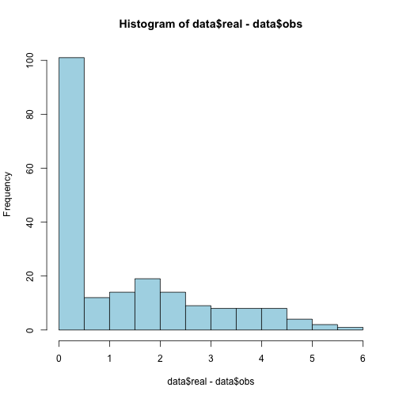

EM math question
================

Instructions [here](https://docs.google.com/document/d/1eQ_MsTKgfI61wu0RZOOTjQY408chI9MRineNtAtzfOs/edit)

# Math part

To do

# Simulation


First, I generate the simulated data


```r
## Params
n <- 100
mu <- c(4, 5)
sigma <- 1

## Complete
set.seed(20130416)
completeData <- as.vector(sapply(mu, function(m) {
    rnorm(n, mean = m, sd = sqrt(sigma))
}))

## Then censor
set.seed(20130416)
censor <- sample(0:1, size = 2 * n, replace = TRUE)

##
idx <- which(censor == 1)
adjust <- runif(n = length(idx), min = 0.1, max = 0.9)
obsData <- completeData
obsData[idx] <- obsData[idx] - (abs(obsData[idx]) * adjust)

## Format the data
data <- data.frame(obs = obsData, censor = censor, real = completeData)
head(data)
```

```
##     obs censor  real
## 1 3.842      1 4.674
## 2 4.132      0 4.132
## 3 2.791      1 4.347
## 4 4.183      0 4.183
## 5 1.112      1 5.416
## 6 3.341      0 3.341
```

```r
summary(data)
```

```
##       obs            censor           real     
##  Min.   :0.404   Min.   :0.000   Min.   :1.58  
##  1st Qu.:1.747   1st Qu.:0.000   1st Qu.:3.82  
##  Median :3.525   Median :1.000   Median :4.64  
##  Mean   :3.404   Mean   :0.505   Mean   :4.62  
##  3rd Qu.:4.981   3rd Qu.:1.000   3rd Qu.:5.43  
##  Max.   :7.123   Max.   :1.000   Max.   :7.80
```

```r

## Check that things are working
hist(data$real - data$obs, col = "light blue")
```

 


Next, I try to run the EM algorithm from the __emplik__ package.


```r
library(emplik)
```

```
## Loading required package: quantreg
```

```
## Loading required package: SparseM
```

```
## Package SparseM (0.97) loaded.  To cite, see citation("SparseM")
```

```
## Attaching package: 'SparseM'
```

```
## The following object(s) are masked from 'package:base':
## 
## backsolve
```

```r

## Now I format the data in the way that emplik expects it to be
dataE <- data
dataE$censor <- ifelse(dataE$censor == 0, 1, 2)

## I don't understand how you define this function
foo <- function(y, xmat) {
    temp <- y - (1 + 2 * xmat)
    return(cbind(temp, xmat * temp))
}

## foobar results
res <- el.cen.EM2(x = dataE$obs, d = dataE$censor, mu = c(0.25, 0.75), fun = foo, 
    xmat = dataE$obs)
res
```

```
## $loglik
## [1] -3904
## 
## $times
##   [1] 0.4042 1.5833 2.0317 2.2601 2.5757 2.6604 2.6840 2.7817 3.0329 3.0475
##  [11] 3.0718 3.1082 3.2152 3.2812 3.3410 3.4455 3.5229 3.5403 3.6666 3.6838
##  [21] 3.6869 3.7530 3.7632 3.7942 3.8239 3.8423 3.9208 3.9619 3.9920 4.0029
##  [31] 4.0864 4.1294 4.1305 4.1316 4.1429 4.1442 4.1490 4.1831 4.1996 4.2194
##  [41] 4.2876 4.3518 4.3605 4.4013 4.6170 4.6280 4.6784 4.6963 4.7174 4.7272
##  [51] 4.7974 4.8022 4.9388 4.9751 4.9973 5.0222 5.1030 5.1107 5.2141 5.2179
##  [61] 5.2428 5.2465 5.2471 5.2506 5.2681 5.2860 5.3333 5.3375 5.3979 5.4327
##  [71] 5.4353 5.4832 5.5359 5.6153 5.6317 5.6616 5.6975 5.7028 5.7099 5.7439
##  [81] 5.7746 5.8002 5.8066 5.8499 5.8692 5.8815 5.8845 5.9071 6.0254 6.1190
##  [91] 6.1271 6.1696 6.2053 6.2294 6.2945 6.3606 6.4400 6.4949 6.5884 7.1230
## 
## $prob
##   [1] 3.595e-08 3.941e-10 3.198e-10 2.930e-10 2.661e-10 2.642e-10 2.637e-10
##   [8] 2.584e-10 2.472e-10 2.471e-10 2.470e-10 2.468e-10 2.375e-10 2.374e-10
##  [15] 2.375e-10 2.378e-10 2.355e-10 2.342e-10 2.340e-10 2.342e-10 2.342e-10
##  [22] 2.323e-10 2.325e-10 2.329e-10 2.320e-10 2.310e-10 2.297e-10 2.304e-10
##  [29] 2.310e-10 2.312e-10 2.316e-10 2.325e-10 2.325e-10 2.326e-10 2.328e-10
##  [36] 2.328e-10 2.330e-10 2.325e-10 2.329e-10 2.334e-10 2.352e-10 2.370e-10
##  [43] 2.373e-10 2.385e-10 2.434e-10 2.439e-10 2.459e-10 2.466e-10 2.462e-10
##  [50] 2.466e-10 2.497e-10 2.499e-10 2.567e-10 2.586e-10 2.598e-10 2.613e-10
##  [57] 2.647e-10 2.651e-10 2.704e-10 2.707e-10 2.724e-10 2.727e-10 2.727e-10
##  [64] 2.730e-10 2.742e-10 2.755e-10 2.791e-10 2.794e-10 2.842e-10 2.872e-10
##  [71] 2.874e-10 2.916e-10 2.965e-10 3.044e-10 3.062e-10 3.094e-10 3.134e-10
##  [78] 3.140e-10 3.148e-10 3.171e-10 3.208e-10 3.240e-10 3.248e-10 3.305e-10
##  [85] 3.332e-10 3.349e-10 3.353e-10 3.385e-10 3.570e-10 3.715e-10 3.730e-10
##  [92] 3.814e-10 3.888e-10 3.940e-10 4.091e-10 4.259e-10 4.487e-10 4.663e-10
##  [99] 5.006e-10 9.276e-10
## 
## $lam
## [1] -1.807e+09  2.397e+08
## 
## $iters
## [1] 25
## 
## $`-2LLR`
## [1] 6636
## 
## $Pval
## [1] 0
```

```r

```


