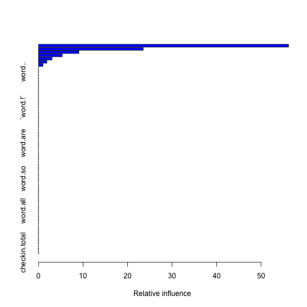
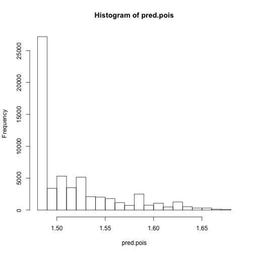

gbm with cross-validation
=======================

Setup

```r
## Libs
library(gbm)
```

```
## Loading required package: survival
```

```
## Loading required package: splines
```

```
## Loading required package: lattice
```

```
## Loaded gbm 2.0-8
```

```r
library(cvTools)
```

```
## Loading required package: robustbase
```

```
## Attaching package: 'robustbase'
```

```
## The following object(s) are masked from 'package:survival':
## 
## heart
```

```r

## Data
load("../lm/trainC.Rdata")

test <- TRUE
if (test) {
    trainC <- trainC[1:1000, ]
}

rmlspe <- function(y, yHat, includeSE = FALSE) {
    rmspe(log(y + 1), log(yHat + 1), includeSE = includeSE)
}

# Remove date and transform the logical vectors into factors
fixStuff <- function(input) {
    res <- input[, !colnames(input) %in% "date"]
    res$business.categories.BeautySpas <- factor(res$business.categories.BeautySpas)
    res$business.categories.Food <- factor(res$business.categories.Food)
    res$business.categories.Restaurants <- factor(res$business.categories.Restaurants)
    res$business.categories.Shopping <- factor(res$business.categories.Shopping)
    res$business.open <- factor(res$business.open)
    return(res)
}
trainC <- fixStuff(trainC)
validateC <- fixStuff(validateC)
```


Just fit one gbm with 10-fold CV

```r

## Fit gbm
fit.gbm.pois <- gbm(votes.useful ~ ., data = trainC, distribution = "poisson", 
    cv.folds = 10)
```

```
## CV: 1 
## Iter   TrainDeviance   ValidDeviance   StepSize   Improve
##      1        1.7498          1.7670     0.0010    0.0000
##      2        1.7490          1.7661     0.0010    0.0003
##      3        1.7481          1.7651     0.0010    0.0003
##      4        1.7478          1.7650     0.0010    0.0001
##      5        1.7470          1.7641     0.0010    0.0004
##      6        1.7464          1.7633     0.0010    0.0003
##      7        1.7461          1.7633     0.0010    0.0000
##      8        1.7453          1.7626     0.0010    0.0003
##      9        1.7447          1.7620     0.0010    0.0001
##     10        1.7438          1.7611     0.0010    0.0004
##     20        1.7350          1.7516     0.0010    0.0003
##     40        1.7208          1.7390     0.0010    0.0001
##     60        1.7065          1.7244     0.0010    0.0004
##     80        1.6941          1.7116     0.0010    0.0001
##    100        1.6818          1.7008     0.0010    0.0002
## 
## CV: 2 
## Iter   TrainDeviance   ValidDeviance   StepSize   Improve
##      1        1.7663          1.6156     0.0010    0.0004
##      2        1.7656          1.6149     0.0010    0.0004
##      3        1.7647          1.6140     0.0010    0.0003
##      4        1.7641          1.6137     0.0010    0.0002
##      5        1.7633          1.6129     0.0010    0.0004
##      6        1.7626          1.6122     0.0010    0.0004
##      7        1.7621          1.6117     0.0010    0.0002
##      8        1.7614          1.6111     0.0010    0.0003
##      9        1.7607          1.6105     0.0010    0.0002
##     10        1.7598          1.6095     0.0010    0.0004
##     20        1.7527          1.6035     0.0010    0.0004
##     40        1.7388          1.5904     0.0010    0.0000
##     60        1.7249          1.5774     0.0010    0.0001
##     80        1.7111          1.5652     0.0010    0.0003
##    100        1.6986          1.5543     0.0010    0.0004
## 
## CV: 3 
## Iter   TrainDeviance   ValidDeviance   StepSize   Improve
##      1        1.7532          1.7321     0.0010    0.0003
##      2        1.7525          1.7313     0.0010    0.0004
##      3        1.7514          1.7302     0.0010    0.0005
##      4        1.7511          1.7301     0.0010    0.0000
##      5        1.7504          1.7292     0.0010    0.0004
##      6        1.7496          1.7283     0.0010    0.0002
##      7        1.7488          1.7273     0.0010    0.0003
##      8        1.7480          1.7262     0.0010    0.0003
##      9        1.7470          1.7250     0.0010    0.0003
##     10        1.7462          1.7241     0.0010    0.0003
##     20        1.7388          1.7165     0.0010    0.0001
##     40        1.7253          1.7013     0.0010    0.0004
##     60        1.7116          1.6855     0.0010    0.0003
##     80        1.6960          1.6684     0.0010    0.0002
##    100        1.6836          1.6546     0.0010    0.0004
## 
## CV: 4 
## Iter   TrainDeviance   ValidDeviance   StepSize   Improve
##      1        1.7763          1.5280     0.0010    0.0003
##      2        1.7752          1.5275     0.0010    0.0004
##      3        1.7742          1.5271     0.0010    0.0005
##      4        1.7736          1.5268     0.0010    0.0002
##      5        1.7727          1.5268     0.0010    0.0005
##      6        1.7724          1.5268     0.0010    0.0000
##      7        1.7713          1.5263     0.0010    0.0004
##      8        1.7705          1.5258     0.0010    0.0003
##      9        1.7702          1.5258     0.0010    0.0000
##     10        1.7691          1.5253     0.0010    0.0005
##     20        1.7614          1.5233     0.0010    0.0005
##     40        1.7459          1.5184     0.0010    0.0005
##     60        1.7303          1.5121     0.0010    0.0004
##     80        1.7177          1.5087     0.0010    0.0005
##    100        1.7038          1.5041     0.0010    0.0001
## 
## CV: 5 
## Iter   TrainDeviance   ValidDeviance   StepSize   Improve
##      1        1.7606          1.6653     0.0010    0.0004
##      2        1.7598          1.6649     0.0010    0.0004
##      3        1.7591          1.6647     0.0010    0.0003
##      4        1.7582          1.6642     0.0010    0.0004
##      5        1.7577          1.6637     0.0010    0.0002
##      6        1.7571          1.6633     0.0010    0.0003
##      7        1.7565          1.6628     0.0010    0.0002
##      8        1.7559          1.6624     0.0010    0.0002
##      9        1.7551          1.6619     0.0010    0.0004
##     10        1.7544          1.6614     0.0010    0.0002
##     20        1.7469          1.6574     0.0010    0.0003
##     40        1.7321          1.6484     0.0010    0.0003
##     60        1.7187          1.6396     0.0010    0.0002
##     80        1.7038          1.6292     0.0010    0.0003
##    100        1.6896          1.6220     0.0010    0.0003
## 
## CV: 6 
## Iter   TrainDeviance   ValidDeviance   StepSize   Improve
##      1        1.7238          2.0024     0.0010    0.0004
##      2        1.7229          2.0017     0.0010    0.0003
##      3        1.7224          2.0016     0.0010    0.0002
##      4        1.7220          2.0015     0.0010    0.0000
##      5        1.7214          2.0009     0.0010    0.0002
##      6        1.7208          2.0007     0.0010    0.0003
##      7        1.7200          2.0000     0.0010    0.0004
##      8        1.7190          1.9994     0.0010    0.0004
##      9        1.7181          1.9987     0.0010    0.0005
##     10        1.7178          1.9985     0.0010    0.0000
##     20        1.7106          1.9940     0.0010    0.0003
##     40        1.6948          1.9848     0.0010    0.0005
##     60        1.6802          1.9758     0.0010    0.0002
##     80        1.6637          1.9649     0.0010    0.0003
##    100        1.6503          1.9572     0.0010    0.0001
## 
## CV: 7 
## Iter   TrainDeviance   ValidDeviance   StepSize   Improve
##      1        1.7347          1.8999     0.0010    0.0004
##      2        1.7343          1.8997     0.0010    0.0001
##      3        1.7332          1.8991     0.0010    0.0004
##      4        1.7323          1.8984     0.0010    0.0004
##      5        1.7320          1.8981     0.0010    0.0001
##      6        1.7311          1.8971     0.0010    0.0004
##      7        1.7306          1.8968     0.0010    0.0002
##      8        1.7297          1.8958     0.0010    0.0004
##      9        1.7286          1.8951     0.0010    0.0004
##     10        1.7283          1.8949     0.0010    0.0001
##     20        1.7208          1.8891     0.0010    0.0004
##     40        1.7067          1.8793     0.0010    0.0004
##     60        1.6914          1.8674     0.0010    0.0003
##     80        1.6767          1.8548     0.0010    0.0004
##    100        1.6629          1.8441     0.0010    0.0002
## 
## CV: 8 
## Iter   TrainDeviance   ValidDeviance   StepSize   Improve
##      1        1.7313          1.9369     0.0010    0.0000
##      2        1.7304          1.9365     0.0010    0.0004
##      3        1.7296          1.9360     0.0010    0.0004
##      4        1.7292          1.9359     0.0010    0.0001
##      5        1.7283          1.9352     0.0010    0.0003
##      6        1.7280          1.9349     0.0010    0.0000
##      7        1.7271          1.9344     0.0010    0.0003
##      8        1.7263          1.9339     0.0010    0.0004
##      9        1.7254          1.9335     0.0010    0.0004
##     10        1.7248          1.9330     0.0010    0.0002
##     20        1.7166          1.9284     0.0010    0.0004
##     40        1.7003          1.9183     0.0010    0.0003
##     60        1.6825          1.9078     0.0010    0.0004
##     80        1.6677          1.8993     0.0010    0.0003
##    100        1.6539          1.8912     0.0010    0.0003
## 
## CV: 9 
## Iter   TrainDeviance   ValidDeviance   StepSize   Improve
##      1        1.7856          1.4518     0.0010    0.0003
##      2        1.7848          1.4502     0.0010    0.0004
##      3        1.7840          1.4491     0.0010    0.0003
##      4        1.7837          1.4492     0.0010    0.0001
##      5        1.7829          1.4479     0.0010    0.0003
##      6        1.7822          1.4469     0.0010    0.0003
##      7        1.7815          1.4456     0.0010    0.0003
##      8        1.7807          1.4443     0.0010    0.0003
##      9        1.7802          1.4434     0.0010    0.0002
##     10        1.7793          1.4421     0.0010    0.0005
##     20        1.7720          1.4304     0.0010    0.0003
##     40        1.7580          1.4064     0.0010    0.0002
##     60        1.7448          1.3856     0.0010    0.0002
##     80        1.7321          1.3641     0.0010    0.0001
##    100        1.7206          1.3428     0.0010   -0.0000
## 
## CV: 10 
## Iter   TrainDeviance   ValidDeviance   StepSize   Improve
##      1        1.7259          1.9837     0.0010    0.0003
##      2        1.7255          1.9834     0.0010    0.0001
##      3        1.7249          1.9829     0.0010    0.0002
##      4        1.7240          1.9821     0.0010    0.0005
##      5        1.7231          1.9811     0.0010    0.0004
##      6        1.7218          1.9801     0.0010    0.0005
##      7        1.7209          1.9796     0.0010    0.0005
##      8        1.7204          1.9790     0.0010    0.0002
##      9        1.7195          1.9785     0.0010    0.0004
##     10        1.7185          1.9779     0.0010    0.0004
##     20        1.7109          1.9727     0.0010    0.0004
##     40        1.6968          1.9626     0.0010    0.0001
##     60        1.6824          1.9527     0.0010    0.0002
##     80        1.6691          1.9428     0.0010    0.0001
##    100        1.6540          1.9321     0.0010    0.0003
## 
## Iter   TrainDeviance   ValidDeviance   StepSize   Improve
##      1        1.7510             nan     0.0010    0.0004
##      2        1.7501             nan     0.0010    0.0004
##      3        1.7495             nan     0.0010    0.0002
##      4        1.7488             nan     0.0010    0.0003
##      5        1.7479             nan     0.0010    0.0003
##      6        1.7469             nan     0.0010    0.0005
##      7        1.7460             nan     0.0010    0.0003
##      8        1.7452             nan     0.0010    0.0004
##      9        1.7444             nan     0.0010    0.0003
##     10        1.7438             nan     0.0010    0.0002
##     20        1.7361             nan     0.0010    0.0002
##     40        1.7207             nan     0.0010    0.0002
##     60        1.7067             nan     0.0010    0.0001
##     80        1.6928             nan     0.0010    0.0003
##    100        1.6793             nan     0.0010    0.0003
```

```r
summary(fit.gbm.pois)
```

 

```
##                                                             var rel.inf
## user.review_count                             user.review_count 56.1453
## `word.\\n`                                           `word.\\n` 23.5149
## `word. `                                               `word. `  9.0694
## word.and                                               word.and  5.3300
## word.of                                                 word.of  3.0576
## word.me                                                 word.me  1.8868
## `word."`                                               `word."`  0.9961
## stars                                                     stars  0.0000
## word..                                                   word..  0.0000
## word.the                                               word.the  0.0000
## `word.,`                                               `word.,`  0.0000
## word.I                                                   word.I  0.0000
## word.a                                                   word.a  0.0000
## word.to                                                 word.to  0.0000
## word.was                                               word.was  0.0000
## word.is                                                 word.is  0.0000
## word.for                                               word.for  0.0000
## word.it                                                 word.it  0.0000
## word.in                                                 word.in  0.0000
## `word.!`                                               `word.!`  0.0000
## word.The                                               word.The  0.0000
## word.that                                             word.that  0.0000
## word.with                                             word.with  0.0000
## word.but                                               word.but  0.0000
## word.you                                               word.you  0.0000
## word.my                                                 word.my  0.0000
## word.on                                                 word.on  0.0000
## word.have                                             word.have  0.0000
## word.this                                             word.this  0.0000
## word.had                                               word.had  0.0000
## word.are                                               word.are  0.0000
## word.they                                             word.they  0.0000
## word.not                                               word.not  0.0000
## `word.)`                                               `word.)`  0.0000
## word.place                                           word.place  0.0000
## word.at                                                 word.at  0.0000
## word.good                                             word.good  0.0000
## word.were                                             word.were  0.0000
## `word.(`                                               `word.(`  0.0000
## word.food                                             word.food  0.0000
## word.we                                                 word.we  0.0000
## word.so                                                 word.so  0.0000
## `word.-`                                               `word.-`  0.0000
## word.be                                                 word.be  0.0000
## word.as                                                 word.as  0.0000
## word.like                                             word.like  0.0000
## word.out                                               word.out  0.0000
## word.there                                           word.there  0.0000
## word.here                                             word.here  0.0000
## word.just                                             word.just  0.0000
## word.great                                           word.great  0.0000
## word.all                                               word.all  0.0000
## user.average_stars                           user.average_stars  0.0000
## business.categories.BeautySpas   business.categories.BeautySpas  0.0000
## business.categories.Food               business.categories.Food  0.0000
## business.categories.Restaurants business.categories.Restaurants  0.0000
## business.categories.Shopping       business.categories.Shopping  0.0000
## business.categories.total             business.categories.total  0.0000
## business.latitude                             business.latitude  0.0000
## business.longitude                           business.longitude  0.0000
## business.open                                     business.open  0.0000
## business.review_count                     business.review_count  0.0000
## business.stars                                   business.stars  0.0000
## business.zipcode                               business.zipcode  0.0000
## checkin.total                                     checkin.total  0.0000
```

```r
pretty.gbm.tree(fit.gbm.pois)
```

```
##   SplitVar SplitCodePred LeftNode RightNode MissingNode ErrorReduction
## 0        8     4.5000000        1         2           3          368.7
## 1       -1    -0.0005269       -1        -1          -1            0.0
## 2       -1     0.0006068       -1        -1          -1            0.0
## 3       -1    -0.0002088       -1        -1          -1            0.0
##   Weight Prediction
## 0    499 -0.0002088
## 1    359 -0.0005269
## 2    140  0.0006068
## 3    499 -0.0002088
```

```r
show(fit.gbm.pois)
```

```
## gbm(formula = votes.useful ~ ., distribution = "poisson", data = trainC, 
##     cv.folds = 10)
## A gradient boosted model with poisson loss function.
## 100 iterations were performed.
## The best cross-validation iteration was 100.
## There were 65 predictors of which 7 had non-zero influence.
```

```r

## Evaluate with validation data set
pred.pois <- predict(fit.gbm.pois, validateC, type = "response")
```

```
## Using 100 trees...
```

```r
e.gbm.pois <- rmlspe(validateC$votes.useful, pred.pois, includeSE = TRUE)
e.gbm.pois
```

```
## $rmspe
## [1] 0.7002
## 
## $se
## [1] 0.001498
```

```r
hist(pred.pois)
```

 

```r

save(fit.gbm.pois, e.gbm.pois, file = "rf.Rdata")
```


Reproducibility

```r
print(proc.time())
```

```
##    user  system elapsed 
##  18.038   0.578  18.655
```

```r
sessionInfo()
```

```
## R version 2.15.3 (2013-03-01)
## Platform: x86_64-apple-darwin9.8.0/x86_64 (64-bit)
## 
## locale:
## [1] en_US.UTF-8/en_US.UTF-8/en_US.UTF-8/C/en_US.UTF-8/en_US.UTF-8
## 
## attached base packages:
## [1] splines   stats     graphics  grDevices utils     datasets  methods  
## [8] base     
## 
## other attached packages:
## [1] cvTools_0.3.2    robustbase_0.9-7 gbm_2.0-8        lattice_0.20-15 
## [5] survival_2.37-4  knitr_1.1       
## 
## loaded via a namespace (and not attached):
## [1] digest_0.6.3   evaluate_0.4.3 formatR_0.7    grid_2.15.3   
## [5] stringr_0.6.2  tools_2.15.3
```

