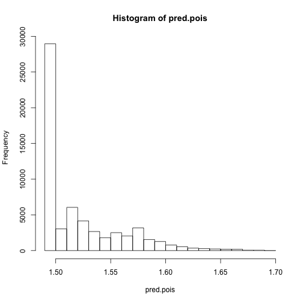

gbm with cross-validation
=======================

Setup

```r
## Libs
library(gbm)
```

```
## Loading required package: survival
```

```
## Loading required package: splines
```

```
## Loading required package: lattice
```

```
## Loaded gbm 2.0-8
```

```r
library(cvTools)
```

```
## Loading required package: robustbase
```

```
## Attaching package: 'robustbase'
```

```
## The following object(s) are masked from 'package:survival':
## 
## heart
```

```r

## Data
load("../lm/trainC.Rdata")

test <- TRUE
if (test) {
    trainC <- trainC[1:1000, ]
}

rmlspe <- function(y, yHat, includeSE = FALSE) {
    rmspe(log(y + 1), log(yHat + 1), includeSE = includeSE)
}

# Remove date and transform the logical vectors into factors
fixStuff <- function(input) {
    res <- input[, !colnames(input) %in% "date"]
    res$business.categories.BeautySpas <- factor(res$business.categories.BeautySpas)
    res$business.categories.Food <- factor(res$business.categories.Food)
    res$business.categories.Restaurants <- factor(res$business.categories.Restaurants)
    res$business.categories.Shopping <- factor(res$business.categories.Shopping)
    res$business.open <- factor(res$business.open)
    return(res)
}
trainC <- fixStuff(trainC)
validateC <- fixStuff(validateC)
```


Just fit one gbm with 10-fold CV

```r

## Fit gbm
fit.gbm.pois <- gbm(votes.useful ~ ., data = trainC, distribution = "poisson", 
    cv.folds = 10)
```

```
## CV: 1 
## Iter   TrainDeviance   ValidDeviance   StepSize   Improve
##      1        1.7579          1.6898     0.0010    0.0002
##      2        1.7571          1.6896     0.0010    0.0003
##      3        1.7564          1.6889     0.0010    0.0002
##      4        1.7557          1.6883     0.0010    0.0004
##      5        1.7551          1.6880     0.0010    0.0002
##      6        1.7545          1.6875     0.0010    0.0002
##      7        1.7537          1.6874     0.0010    0.0003
##      8        1.7530          1.6868     0.0010    0.0003
##      9        1.7525          1.6867     0.0010    0.0002
##     10        1.7519          1.6864     0.0010    0.0001
##     20        1.7442          1.6796     0.0010    0.0003
##     40        1.7293          1.6680     0.0010    0.0004
##     60        1.7147          1.6571     0.0010    0.0002
##     80        1.7013          1.6459     0.0010    0.0002
##    100        1.6878          1.6357     0.0010    0.0002
## 
## CV: 2 
## Iter   TrainDeviance   ValidDeviance   StepSize   Improve
##      1        1.7369          1.8820     0.0010    0.0003
##      2        1.7360          1.8814     0.0010    0.0004
##      3        1.7350          1.8807     0.0010    0.0005
##      4        1.7340          1.8802     0.0010    0.0004
##      5        1.7333          1.8800     0.0010    0.0002
##      6        1.7322          1.8792     0.0010    0.0005
##      7        1.7317          1.8791     0.0010    0.0002
##      8        1.7311          1.8787     0.0010    0.0002
##      9        1.7304          1.8781     0.0010    0.0004
##     10        1.7296          1.8777     0.0010    0.0004
##     20        1.7213          1.8737     0.0010    0.0004
##     40        1.7065          1.8669     0.0010    0.0003
##     60        1.6908          1.8578     0.0010    0.0002
##     80        1.6770          1.8503     0.0010    0.0002
##    100        1.6630          1.8429     0.0010    0.0004
## 
## CV: 3 
## Iter   TrainDeviance   ValidDeviance   StepSize   Improve
##      1        1.7209          2.0309     0.0010    0.0003
##      2        1.7202          2.0303     0.0010    0.0003
##      3        1.7196          2.0301     0.0010    0.0002
##      4        1.7190          2.0299     0.0010    0.0003
##      5        1.7180          2.0294     0.0010    0.0004
##      6        1.7175          2.0293     0.0010    0.0002
##      7        1.7169          2.0292     0.0010    0.0002
##      8        1.7166          2.0291     0.0010    0.0000
##      9        1.7159          2.0286     0.0010    0.0003
##     10        1.7150          2.0281     0.0010    0.0004
##     20        1.7071          2.0226     0.0010    0.0003
##     40        1.6921          2.0140     0.0010    0.0004
##     60        1.6774          2.0040     0.0010    0.0005
##     80        1.6614          1.9936     0.0010    0.0001
##    100        1.6486          1.9869     0.0010    0.0002
## 
## CV: 4 
## Iter   TrainDeviance   ValidDeviance   StepSize   Improve
##      1        1.7773          1.5210     0.0010    0.0004
##      2        1.7769          1.5211     0.0010    0.0001
##      3        1.7760          1.5207     0.0010    0.0004
##      4        1.7752          1.5203     0.0010    0.0004
##      5        1.7744          1.5198     0.0010    0.0004
##      6        1.7738          1.5189     0.0010    0.0002
##      7        1.7732          1.5188     0.0010    0.0002
##      8        1.7725          1.5183     0.0010    0.0004
##      9        1.7715          1.5172     0.0010    0.0005
##     10        1.7709          1.5161     0.0010    0.0002
##     20        1.7634          1.5137     0.0010    0.0002
##     40        1.7482          1.5011     0.0010    0.0002
##     60        1.7347          1.4885     0.0010    0.0001
##     80        1.7190          1.4774     0.0010    0.0005
##    100        1.7034          1.4636     0.0010    0.0003
## 
## CV: 5 
## Iter   TrainDeviance   ValidDeviance   StepSize   Improve
##      1        1.7513          1.7496     0.0010    0.0003
##      2        1.7510          1.7495     0.0010    0.0000
##      3        1.7502          1.7487     0.0010    0.0004
##      4        1.7494          1.7479     0.0010    0.0003
##      5        1.7484          1.7470     0.0010    0.0005
##      6        1.7475          1.7462     0.0010    0.0005
##      7        1.7467          1.7457     0.0010    0.0003
##      8        1.7463          1.7457     0.0010    0.0000
##      9        1.7460          1.7455     0.0010    0.0000
##     10        1.7457          1.7455     0.0010    0.0000
##     20        1.7389          1.7389     0.0010    0.0004
##     40        1.7241          1.7254     0.0010    0.0005
##     60        1.7101          1.7124     0.0010    0.0004
##     80        1.6963          1.7005     0.0010    0.0003
##    100        1.6818          1.6866     0.0010    0.0001
## 
## CV: 6 
## Iter   TrainDeviance   ValidDeviance   StepSize   Improve
##      1        1.7383          1.8635     0.0010    0.0004
##      2        1.7379          1.8634     0.0010    0.0000
##      3        1.7372          1.8630     0.0010    0.0003
##      4        1.7364          1.8624     0.0010    0.0004
##      5        1.7357          1.8620     0.0010    0.0004
##      6        1.7348          1.8615     0.0010    0.0004
##      7        1.7344          1.8613     0.0010    0.0001
##      8        1.7336          1.8608     0.0010    0.0004
##      9        1.7327          1.8603     0.0010    0.0004
##     10        1.7319          1.8598     0.0010    0.0004
##     20        1.7246          1.8545     0.0010    0.0004
##     40        1.7102          1.8445     0.0010    0.0003
##     60        1.6975          1.8369     0.0010    0.0004
##     80        1.6830          1.8270     0.0010    0.0002
##    100        1.6682          1.8160     0.0010    0.0004
## 
## CV: 7 
## Iter   TrainDeviance   ValidDeviance   StepSize   Improve
##      1        1.7131          2.1084     0.0010    0.0001
##      2        1.7122          2.1079     0.0010    0.0004
##      3        1.7116          2.1076     0.0010    0.0003
##      4        1.7105          2.1071     0.0010    0.0004
##      5        1.7099          2.1068     0.0010    0.0002
##      6        1.7089          2.1065     0.0010    0.0004
##      7        1.7080          2.1059     0.0010    0.0003
##      8        1.7073          2.1051     0.0010    0.0004
##      9        1.7068          2.1049     0.0010    0.0003
##     10        1.7060          2.1040     0.0010    0.0004
##     20        1.6992          2.0992     0.0010    0.0002
##     40        1.6851          2.0909     0.0010    0.0001
##     60        1.6697          2.0810     0.0010    0.0001
##     80        1.6550          2.0695     0.0010    0.0001
##    100        1.6423          2.0597     0.0010    0.0001
## 
## CV: 8 
## Iter   TrainDeviance   ValidDeviance   StepSize   Improve
##      1        1.7874          1.4372     0.0010    0.0003
##      2        1.7869          1.4368     0.0010    0.0001
##      3        1.7865          1.4359     0.0010    0.0001
##      4        1.7857          1.4349     0.0010    0.0003
##      5        1.7850          1.4341     0.0010    0.0003
##      6        1.7843          1.4334     0.0010    0.0004
##      7        1.7839          1.4326     0.0010    0.0002
##      8        1.7831          1.4317     0.0010    0.0002
##      9        1.7824          1.4311     0.0010    0.0003
##     10        1.7818          1.4300     0.0010    0.0001
##     20        1.7743          1.4195     0.0010    0.0003
##     40        1.7602          1.4015     0.0010    0.0005
##     60        1.7462          1.3835     0.0010    0.0003
##     80        1.7336          1.3679     0.0010    0.0003
##    100        1.7200          1.3507     0.0010    0.0004
## 
## CV: 9 
## Iter   TrainDeviance   ValidDeviance   StepSize   Improve
##      1        1.7763          1.5282     0.0010    0.0004
##      2        1.7759          1.5278     0.0010    0.0001
##      3        1.7748          1.5266     0.0010    0.0005
##      4        1.7740          1.5258     0.0010    0.0004
##      5        1.7733          1.5249     0.0010    0.0003
##      6        1.7726          1.5240     0.0010    0.0003
##      7        1.7719          1.5234     0.0010    0.0002
##      8        1.7711          1.5225     0.0010    0.0003
##      9        1.7705          1.5218     0.0010    0.0003
##     10        1.7698          1.5208     0.0010    0.0003
##     20        1.7624          1.5146     0.0010    0.0003
##     40        1.7469          1.4999     0.0010    0.0005
##     60        1.7326          1.4884     0.0010    0.0002
##     80        1.7191          1.4760     0.0010    0.0004
##    100        1.7046          1.4634     0.0010    0.0001
## 
## CV: 10 
## Iter   TrainDeviance   ValidDeviance   StepSize   Improve
##      1        1.7464          1.7923     0.0010    0.0003
##      2        1.7462          1.7922     0.0010    0.0001
##      3        1.7455          1.7915     0.0010    0.0002
##      4        1.7447          1.7907     0.0010    0.0004
##      5        1.7439          1.7896     0.0010    0.0003
##      6        1.7431          1.7884     0.0010    0.0003
##      7        1.7424          1.7873     0.0010    0.0003
##      8        1.7418          1.7863     0.0010    0.0001
##      9        1.7414          1.7858     0.0010    0.0001
##     10        1.7409          1.7853     0.0010    0.0002
##     20        1.7341          1.7773     0.0010    0.0001
##     40        1.7202          1.7593     0.0010    0.0005
##     60        1.7084          1.7479     0.0010    0.0001
##     80        1.6950          1.7304     0.0010    0.0004
##    100        1.6840          1.7189     0.0010    0.0000
## 
## Iter   TrainDeviance   ValidDeviance   StepSize   Improve
##      1        1.7509             nan     0.0010    0.0004
##      2        1.7503             nan     0.0010    0.0002
##      3        1.7495             nan     0.0010    0.0004
##      4        1.7487             nan     0.0010    0.0004
##      5        1.7478             nan     0.0010    0.0004
##      6        1.7470             nan     0.0010    0.0003
##      7        1.7467             nan     0.0010    0.0001
##      8        1.7461             nan     0.0010    0.0003
##      9        1.7455             nan     0.0010    0.0002
##     10        1.7451             nan     0.0010    0.0002
##     20        1.7377             nan     0.0010    0.0003
##     40        1.7234             nan     0.0010    0.0004
##     60        1.7108             nan     0.0010    0.0002
##     80        1.6963             nan     0.0010    0.0004
##    100        1.6832             nan     0.0010    0.0003
```

```r
# summary(fit.gbm.pois)
pretty.gbm.tree(fit.gbm.pois)
```

```
##   SplitVar SplitCodePred LeftNode RightNode MissingNode ErrorReduction
## 0       52     2.540e+02        1         2           3          653.9
## 1       -1    -3.184e-04       -1        -1          -1            0.0
## 2       -1     1.059e-03       -1        -1          -1            0.0
## 3       -1    -1.279e-04       -1        -1          -1            0.0
##   Weight Prediction
## 0    499 -0.0001279
## 1    430 -0.0003184
## 2     69  0.0010590
## 3    499 -0.0001279
```

```r
show(fit.gbm.pois)
```

```
## gbm(formula = votes.useful ~ ., distribution = "poisson", data = trainC, 
##     cv.folds = 10)
## A gradient boosted model with poisson loss function.
## 100 iterations were performed.
## The best cross-validation iteration was 100.
## There were 65 predictors of which 7 had non-zero influence.
```

```r

## Evaluate with validation data set
pred.pois <- predict(fit.gbm.pois, validateC, type = "response")
```

```
## Using 100 trees...
```

```r
e.gbm.pois <- rmlspe(validateC$votes.useful, pred.pois, includeSE = TRUE)
e.gbm.pois
```

```
## $rmspe
## [1] 0.7013
## 
## $se
## [1] 0.001497
```

```r
hist(pred.pois)
```

 

```r

save(fit.gbm.pois, e.gbm.pois, file = "gbm.Rdata")
```


Reproducibility

```r
print(proc.time())
```

```
##    user  system elapsed 
##  17.660   0.566  18.267
```

```r
sessionInfo()
```

```
## R version 2.15.3 (2013-03-01)
## Platform: x86_64-apple-darwin9.8.0/x86_64 (64-bit)
## 
## locale:
## [1] en_US.UTF-8/en_US.UTF-8/en_US.UTF-8/C/en_US.UTF-8/en_US.UTF-8
## 
## attached base packages:
## [1] splines   stats     graphics  grDevices utils     datasets  methods  
## [8] base     
## 
## other attached packages:
## [1] cvTools_0.3.2    robustbase_0.9-7 gbm_2.0-8        lattice_0.20-15 
## [5] survival_2.37-4  knitr_1.1       
## 
## loaded via a namespace (and not attached):
## [1] digest_0.6.3   evaluate_0.4.3 formatR_0.7    grid_2.15.3   
## [5] stringr_0.6.2  tools_2.15.3
```

