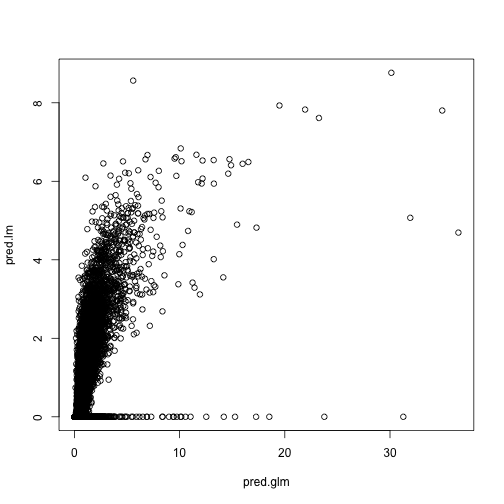
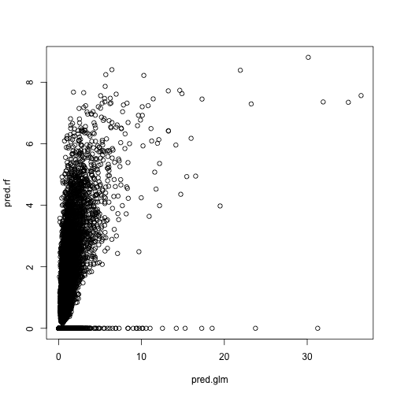
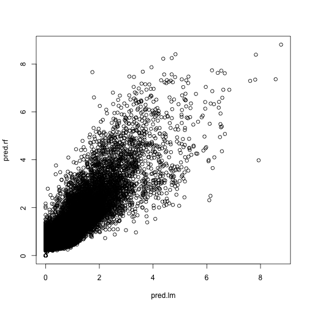

Merge and predict for test data
===============================


```r
## Libs
library(gbm)
```

```
## Loading required package: survival
```

```
## Loading required package: splines
```

```
## Loading required package: lattice
```

```
## Loaded gbm 2.0-8
```

```r
library(randomForest)
```

```
## randomForest 4.6-7
```

```
## Type rfNews() to see new features/changes/bug fixes.
```

```r

## Test data
load("../../data/compressReview-small-quick/testReview.Rdata")
testReview$date <- as.Date(testReview$date)

## Load model results
load("../gbm/gbm.Rdata")
load("../lm/lm.Rdata")
load("../glm-pois/glm-pois.Rdata")
load("../rf/rf.Rdata")


## Setup for predicting with rf
rfpred <- testReview
words <- grep("word.", colnames(rfpred))
colnames(rfpred)[words] <- paste0("word", 1:length(words))
valx <- rfpred[, !colnames(rfpred) %in% c("user_id", "business_id", "review_id", 
    "user.name", "business.city", "votes.useful")]
rfidx <- complete.cases(valx)
valx <- valx[rfidx, ]


## Setup for predicting with gbm
fixStuff <- function(input) {
    res <- input[, !colnames(input) %in% "date"]
    res$business.categories.BeautySpas <- factor(res$business.categories.BeautySpas)
    res$business.categories.Food <- factor(res$business.categories.Food)
    res$business.categories.Restaurants <- factor(res$business.categories.Restaurants)
    res$business.categories.Shopping <- factor(res$business.categories.Shopping)
    res$business.open <- factor(res$business.open)
    return(res)
}
gbmpred <- fixStuff(testReview)
```


Make predictions

```r


## lm
pred.lm <- predict(fit.aic, testReview)
pred.lm[is.na(pred.lm)] <- 0
pred.lm[pred.lm < 0] <- 0

## gbm
pred.gbm <- predict(fit.gbm.pois, gbmpred, type = "response")
```

```
## Using 500 trees...
```

```r

## glm
pred.glm <- predict(fit.pois.bic, testReview, type = "response")
pred.glm[is.na(pred.glm)] <- 0
plot(pred.glm, pred.lm)
```

 

```r

## random forest
pred.rf <- rep(0, nrow(testReview))
pred.rf[rfidx] <- predict(rf, valx)
plot(pred.glm, pred.rf)
```

 

```r
plot(pred.lm, pred.rf)
```

 

```r

preds <- data.frame(lm = pred.lm, gbm = pred.gbm, glm = pred.glm, rf = pred.rf)
final <- data.frame(id = testReview$review_id, votes = rowMeans(preds))


final.round <- final
final.round$votes <- round(final.round$votes)

write.csv(final, file = "preds.csv", row.names = FALSE, quote = FALSE)
write.csv(final.round, file = "preds.round.csv", row.names = FALSE, quote = FALSE)

save(preds, final, final.round, file = "preds.Rdata")
```

