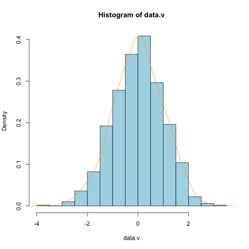
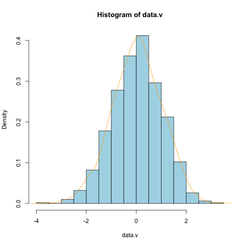
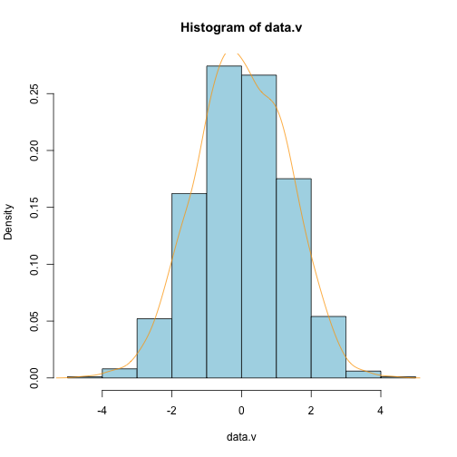
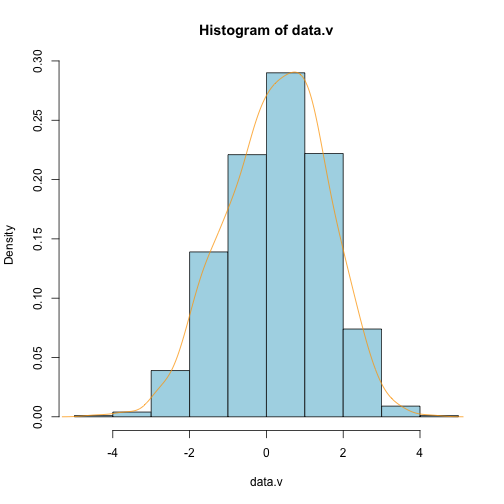
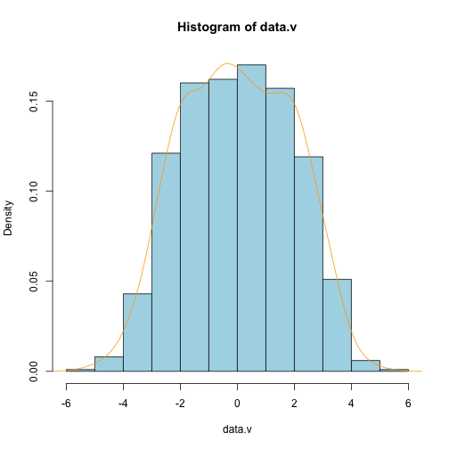
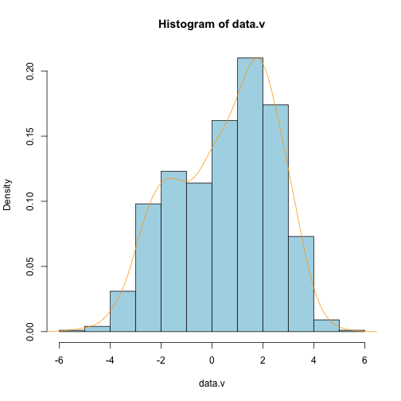
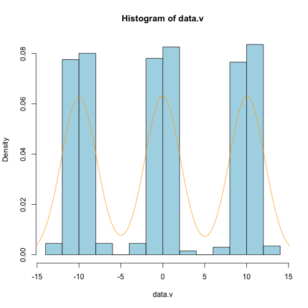
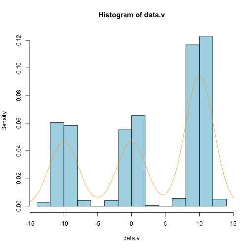

EM algorithm in class exercise
==============================

[These are the instructions](https://docs.google.com/document/d/19jfaVWXRpYDKPQ6KmqZXqRvIgqdZPOab5SIuK16ju8c/edit)


```r

sigma <- 1
mu <- c(-0.1, 0, 0.1)

runMu <- function(mu, sigma, p = c(1/3, 1/3, 1/3), seed = "20130402", n = 1000) {
    set.seed(seed)
    
    data <- sapply(1:length(mu), function(i) {
        rnorm(n * p[i], mu[i], sigma)
    })
    
    return(data)
}
makePlot <- function(data) {
    if (class(data) == "matrix") 
        data.v <- as.vector(data)
    if (class(data) == "list") 
        data.v <- unlist(data)
    
    plot <- hist(data.v, freq = FALSE, col = "light blue")
    lines(density(data.v), col = "orange")
    return(NULL)
}


d1 <- runMu(mu, sigma = sigma)
makePlot(d1)
```

 

```
## NULL
```

```r

d1.uneven <- runMu(mu, sigma = sigma, p = c(1/4, 1/4, 1/2))
makePlot(d1.uneven)
```

 

```
## NULL
```

```r

mu2 <- c(-1, 0, 1)
d2 <- runMu(mu2, sigma = sigma)
makePlot(d2)
```

 

```
## NULL
```

```r

d2.uneven <- runMu(mu2, sigma = sigma, p = c(1/4, 1/4, 1/2))
makePlot(d2.uneven)
```

 

```
## NULL
```

```r

mu3 <- c(-2, 0, 2)
d3 <- runMu(mu3, sigma = sigma)
makePlot(d3)
```

 

```
## NULL
```

```r

d3.uneven <- runMu(mu3, sigma = sigma, p = c(1/4, 1/4, 1/2))
makePlot(d3.uneven)
```

 

```
## NULL
```

```r

mu4 <- c(-10, 0, 10)
d4 <- runMu(mu4, sigma = sigma)
makePlot(d4)
```

 

```
## NULL
```

```r

d4.uneven <- runMu(mu4, sigma = sigma, p = c(1/4, 1/4, 1/2))
makePlot(d4.uneven)
```

 

```
## NULL
```

