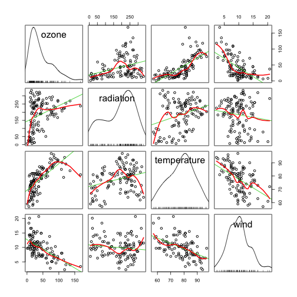

Smoothing in class practice
===========================

Instructions [here](https://docs.google.com/document/d/1Vb5umhAVqGffA17HzkIMJirgCz0mXDrO-zvPiZFbVsY/edit).


```r
library(ElemStatLearn)
data <- ozone

## Quick exploration
head(data)
```

```
##   ozone radiation temperature wind
## 1    41       190          67  7.4
## 2    36       118          72  8.0
## 3    12       149          74 12.6
## 4    18       313          62 11.5
## 5    23       299          65  8.6
## 6    19        99          59 13.8
```

```r
summary(data)
```

```
##      ozone         radiation    temperature        wind      
##  Min.   :  1.0   Min.   :  7   Min.   :57.0   Min.   : 2.30  
##  1st Qu.: 18.0   1st Qu.:114   1st Qu.:71.0   1st Qu.: 7.40  
##  Median : 31.0   Median :207   Median :79.0   Median : 9.70  
##  Mean   : 42.1   Mean   :185   Mean   :77.8   Mean   : 9.94  
##  3rd Qu.: 62.0   3rd Qu.:256   3rd Qu.:84.5   3rd Qu.:11.50  
##  Max.   :168.0   Max.   :334   Max.   :97.0   Max.   :20.70
```

```r

## Plot
library(car)
```

```
## Loading required package: MASS
```

```
## Loading required package: nnet
```

```r
scatterplotMatrix(~ozone + radiation + temperature + wind, data = data, spread = FALSE)
```

 


